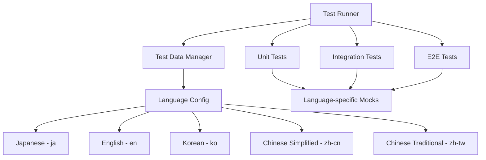
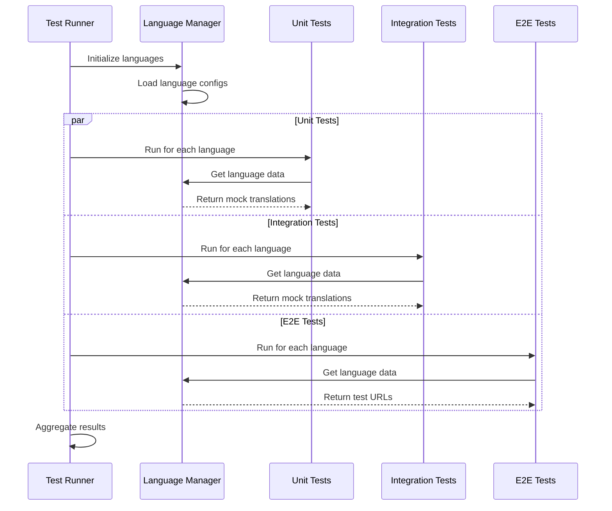

# 多言語テスト拡張 設計書

## 概要

現在の日英2言語テストシステムを拡張し、韓国語（ko）、中国語簡体字（zh-cn）、中国語繁体字（zh-tw）を追加した5言語対応テストシステムを設計する。

## アーキテクチャ

### 1. テストデータ管理アーキテクチャ



### 2. テスト実行フロー



## コンポーネント設計

### 1. Language Configuration Manager

```typescript
interface LanguageConfig {
  code: string
  name: string
  direction: 'ltr' | 'rtl'
  translations: Record<string, string>
  testUrls: {
    home: string
    features: string
    pricing: string
  }
  fonts: string[]
  dateFormat: string
  numberFormat: Intl.NumberFormatOptions
}

interface MultilingualTestConfig {
  languages: LanguageConfig[]
  defaultLanguage: string
  parallelExecution: boolean
  timeout: number
}
```

### 2. Test Data Provider

```typescript
class TestDataProvider {
  private configs: Map<string, LanguageConfig>
  
  constructor(languages: LanguageConfig[]) {
    this.configs = new Map(languages.map(lang => [lang.code, lang]))
  }
  
  getTranslations(languageCode: string): Record<string, string>
  getTestUrls(languageCode: string): Record<string, string>
  getLanguageConfig(languageCode: string): LanguageConfig
  getAllLanguages(): string[]
}
```

### 3. Mock Translation Generator

```typescript
class MockTranslationGenerator {
  generateMockTranslations(
    baseTranslations: Record<string, string>,
    targetLanguage: string
  ): Record<string, string>
  
  generateLanguageSpecificContent(
    content: string,
    language: string
  ): string
  
  validateTranslationKeys(
    translations: Record<string, string>
  ): ValidationResult
}
```

## データモデル

### 1. 言語設定データ構造

```typescript
const LANGUAGE_CONFIGS: LanguageConfig[] = [
  {
    code: 'ja',
    name: '日本語',
    direction: 'ltr',
    translations: {
      'hero.title': '美容サロン向け予約管理システム',
      'hero.cta.primary': '無料で始める',
      // ... more translations
    },
    testUrls: {
      home: '/ja',
      features: '/ja/features',
      pricing: '/ja/pricing'
    },
    fonts: ['Noto Sans JP', 'Hiragino Sans'],
    dateFormat: 'YYYY年MM月DD日',
    numberFormat: { locale: 'ja-JP', currency: 'JPY' }
  },
  {
    code: 'ko',
    name: '한국어',
    direction: 'ltr',
    translations: {
      'hero.title': '미용실 예약 관리 시스템',
      'hero.cta.primary': '무료로 시작하기',
      // ... more translations
    },
    testUrls: {
      home: '/ko',
      features: '/ko/features',
      pricing: '/ko/pricing'
    },
    fonts: ['Noto Sans KR', 'Malgun Gothic'],
    dateFormat: 'YYYY년 MM월 DD일',
    numberFormat: { locale: 'ko-KR', currency: 'KRW' }
  },
  // ... other languages
]
```

### 2. テスト実行設定

```typescript
interface TestExecutionConfig {
  languages: string[]
  testTypes: ('unit' | 'integration' | 'e2e')[]
  parallel: boolean
  timeout: {
    unit: number
    integration: number
    e2e: number
  }
  coverage: {
    threshold: number
    perLanguage: boolean
  }
}
```

## テスト戦略

### 1. Unit Tests

**言語固有のモック戦略:**
- 各言語の翻訳データを動的に生成
- 文字エンコーディングテスト
- 文字数制限テスト（中国語の長い文字列対応）

**実装例:**
```typescript
describe.each(SUPPORTED_LANGUAGES)('Unit Tests - %s', (language) => {
  beforeEach(() => {
    mockTranslations(language)
  })
  
  it('should render hero section correctly', () => {
    const translations = getTranslations(language)
    render(<HeroSection locale={language} />)
    expect(screen.getByText(translations['hero.title'])).toBeInTheDocument()
  })
})
```

### 2. Integration Tests

**多言語コンポーネント連携テスト:**
- 言語切り替え時のstate管理
- 言語固有のフォーマット処理
- 言語間のナビゲーション

**実装例:**
```typescript
describe('Multilingual Integration', () => {
  test.each(LANGUAGE_PAIRS)('Language switching from %s to %s', 
    async (fromLang, toLang) => {
      render(<LandingPageClient locale={fromLang} />)
      
      // Switch language
      await switchLanguage(toLang)
      
      // Verify content changed
      const newTranslations = getTranslations(toLang)
      expect(screen.getByText(newTranslations['hero.title'])).toBeInTheDocument()
    }
  )
})
```

### 3. E2E Tests

**ブラウザ環境での多言語テスト:**
- 各言語URLでのページ読み込み
- フォント読み込み確認
- 文字表示確認

**実装例:**
```typescript
SUPPORTED_LANGUAGES.forEach(language => {
  test.describe(`E2E Tests - ${language}`, () => {
    test('should load page correctly', async ({ page }) => {
      await page.goto(`/${language}`)
      
      // Check language-specific content
      const config = getLanguageConfig(language)
      await expect(page.locator('h1')).toContainText(
        config.translations['hero.title']
      )
    })
  })
})
```

## パフォーマンス最適化

### 1. 並列実行戦略

```typescript
interface ParallelExecutionConfig {
  maxConcurrency: number
  languageGroups: string[][]
  resourceAllocation: {
    memory: string
    cpu: string
  }
}

const PARALLEL_CONFIG: ParallelExecutionConfig = {
  maxConcurrency: 3,
  languageGroups: [
    ['ja', 'en'],      // Group 1: Latin + CJK
    ['ko', 'zh-cn'],   // Group 2: CJK
    ['zh-tw']          // Group 3: Traditional Chinese
  ],
  resourceAllocation: {
    memory: '2GB',
    cpu: '2 cores'
  }
}
```

### 2. キャッシュ戦略

```typescript
class TestDataCache {
  private cache: Map<string, any> = new Map()
  
  getCachedTranslations(language: string): Record<string, string> | null
  setCachedTranslations(language: string, translations: Record<string, string>): void
  invalidateCache(language?: string): void
}
```

## エラーハンドリング

### 1. 言語固有エラー処理

```typescript
class MultilingualTestError extends Error {
  constructor(
    message: string,
    public language: string,
    public testType: string,
    public originalError?: Error
  ) {
    super(`[${language}] ${testType}: ${message}`)
  }
}

class ErrorHandler {
  handleLanguageSpecificError(error: MultilingualTestError): void
  aggregateErrors(errors: MultilingualTestError[]): TestSummary
  generateErrorReport(errors: MultilingualTestError[]): string
}
```

### 2. フォールバック戦略

```typescript
interface FallbackConfig {
  missingTranslations: 'error' | 'warn' | 'fallback'
  fallbackLanguage: string
  fontLoadingTimeout: number
  networkTimeout: number
}
```

## テスト結果レポート

### 1. 言語別レポート生成

```typescript
interface LanguageTestResult {
  language: string
  passed: number
  failed: number
  skipped: number
  coverage: number
  duration: number
  errors: TestError[]
}

interface MultilingualTestReport {
  summary: {
    totalLanguages: number
    overallPassed: number
    overallFailed: number
    averageCoverage: number
    totalDuration: number
  }
  languageResults: LanguageTestResult[]
  recommendations: string[]
}
```

### 2. CI/CD統合

```yaml
# GitHub Actions example
name: Multilingual Tests
on: [push, pull_request]

jobs:
  multilingual-tests:
    runs-on: ubuntu-latest
    strategy:
      matrix:
        language: [ja, en, ko, zh-cn, zh-tw]
    steps:
      - uses: actions/checkout@v3
      - name: Setup Node.js
        uses: actions/setup-node@v3
      - name: Install dependencies
        run: npm ci
      - name: Run tests for ${{ matrix.language }}
        run: npm run test:lang -- --language=${{ matrix.language }}
      - name: Upload coverage
        uses: codecov/codecov-action@v3
        with:
          flags: ${{ matrix.language }}
```

## セキュリティ考慮事項

### 1. 文字エンコーディングセキュリティ

- XSS攻撃対策（各言語の特殊文字）
- SQLインジェクション対策（中国語・韓国語の特殊文字）
- CSRFトークンの多言語対応

### 2. フォント読み込みセキュリティ

- CDNからのフォント読み込み検証
- フォントファイルの整合性チェック
- フォント読み込み失敗時のフォールバック

## 保守性とスケーラビリティ

### 1. 新言語追加プロセス

1. 言語設定ファイルの追加
2. 翻訳データの準備
3. テストケースの自動生成
4. CI/CDパイプラインの更新

### 2. 翻訳データ管理

```typescript
interface TranslationManagement {
  addLanguage(config: LanguageConfig): Promise<void>
  updateTranslations(language: string, updates: Record<string, string>): Promise<void>
  validateTranslations(language: string): ValidationResult
  syncTranslations(): Promise<void>
}
```

この設計により、現在の2言語から5言語への拡張が効率的に実現でき、将来的な言語追加も容易になります。