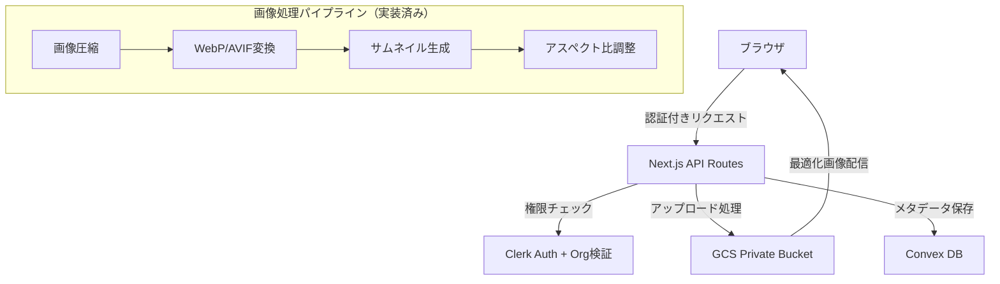
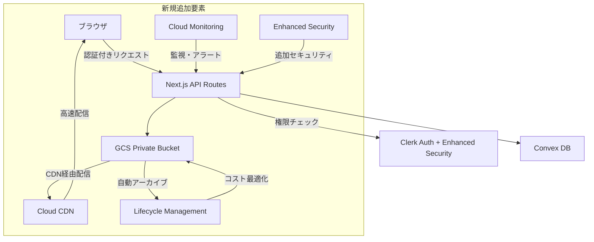

# Google Cloud Storage 最適化・運用改善 実装仕様書

**文書バージョン**: 2.0  
**作成日**: 2025年1月  
**更新日**: 2025年1月（現在の実装状況を反映）  
**プロジェクト**: Bcker（ブッカー）- 美容サロン向けSaaS予約管理プラットフォーム

## 1. 概要

### 1.1 目的
本仕様書は、Bckerプロジェクトにおける既存のGoogle Cloud Storage（GCS）実装の最適化と運用改善について、開発者が実装するための詳細な技術仕様を定義する。

**重要**: このプロジェクトは既に本格的なGCS実装が完了しており、基本的なセキュリティ、画像処理、認証機能は実装済みです。本仕様書は追加の最適化に焦点を当てています。

### 1.2 現在の実装状況（✅完了済み）
- ✅ **セキュリティ**: Clerk認証 + 組織レベルアクセス制御
- ✅ **画像処理**: WebP/AVIF最適化、自動圧縮、サムネイル生成
- ✅ **API設計**: 2つのアップロード方式（FormData + Signed URL）
- ✅ **エラーハンドリング**: 包括的なエラー処理とロールバック機能
- ✅ **バリデーション**: Zodによる厳密な入力検証
- ✅ **コンポーネント**: SingleImageDrop、MultiImageDrop統合
- ✅ **モバイル最適化**: iOS特有の制限対応

### 1.3 改善対象スコープ
- CDN統合による配信最適化
- ライフサイクル管理によるコスト最適化  
- 監視・アラート体制の構築
- パフォーマンス改善
- セキュリティ強化（追加レイヤー）

### 1.4 前提条件
- Node.js 18.x 以上
- Next.js 15.3.3（App Router）
- Convex 1.23.0
- **既存のGoogleStorageService実装**
- Clerk認証システム
- 現在の画像最適化パイプライン

## 2. 現在のシステムアーキテクチャと改善計画

### 2.1 現在のアーキテクチャ（✅実装済み）



### 2.2 改善後のアーキテクチャ（追加要素）



## 3. 現在のデータモデルと改善点

### 3.1 現在のディレクトリ構造（✅実装済み）

```
bocker-images/ (実際のバケット名)
├── {org_id}/
│   ├── staff/
│   │   ├── {uuid}_{timestamp}.webp      # オリジナル
│   │   └── {uuid}_{timestamp}_thumb.webp # サムネイル
│   ├── menu/
│   │   ├── {uuid}_{timestamp}.webp
│   │   └── {uuid}_{timestamp}_thumb.webp
│   ├── option/
│   │   ├── {uuid}_{timestamp}.webp
│   │   └── {uuid}_{timestamp}_thumb.webp
│   ├── carte/
│   │   ├── {uuid}_{timestamp}.webp
│   │   └── {uuid}_{timestamp}_thumb.webp
│   ├── customer/
│   │   ├── {uuid}_{timestamp}.webp
│   │   └── {uuid}_{timestamp}_thumb.webp
│   └── other/
│       ├── {uuid}_{timestamp}.webp
│       └── {uuid}_{timestamp}_thumb.webp
```

**特徴**:
- UUID + タイムスタンプによる一意性保証
- 自動的なサムネイル生成（_thumbサフィックス）
- 組織ID（org_id）による完全分離
- WebP形式での統一

### 3.2 改善提案：階層最適化

```
bocker-images/
├── {org_id}/
│   ├── hot/              # 頻繁アクセス（30日以内）
│   │   ├── staff/
│   │   ├── menu/
│   │   └── carte/
│   ├── warm/             # 定期アクセス（1年以内）
│   │   ├── customer/
│   │   └── option/
│   └── cold/             # アーカイブ（1年以上）
│       └── archived/
```

### 3.3 現在のConvexスキーマ（✅実装済み）

```typescript
// convex/schema.ts の実際の実装
export const imageType = v.object({
  original_url: v.string(),    // GCS完全URL
  thumbnail_url: v.string(),   // サムネイルGCS URL
});

export const staffs = defineTable({
  profile_image: v.optional(imageType),  // 画像オブジェクト
  // ... 他のフィールド
});

export const menus = defineTable({
  images: v.array(imageType),           // 画像配列
  // ... 他のフィールド
});

export const options = defineTable({
  images: v.array(imageType),           // 画像配列
  // ... 他のフィールド
});

export const customers = defineTable({
  profile_image: v.optional(imageType), // 画像オブジェクト
  // ... 他のフィールド
});
```

**現在の設計の優秀な点**:
- 統一された`imageType`による型安全性
- オリジナル・サムネイル両方のURL管理
- 配列による複数画像対応
- オプショナル型による柔軟性

## 4. 現在のAPI仕様と改善提案

### 4.1 現在のAPI実装（✅完了済み）

#### アップロード関連エンドポイント

**A. FormDataアップロード**
```
POST /api/storage
```

**リクエスト例**:
```typescript
// services/gcp/cloud_storage/types.ts
interface UploadImageRequest {
  images: File[];
  directory: ImageDirectory; // 'staff' | 'menu' | 'option' | 'carte' | 'customer' | 'other'
  quality: ImageQuality;     // 'low' | 'medium' | 'high'
  aspectType?: AspectType;   // 'square' | 'landscape' | 'mobile'
}
```

**B. 署名付きURLアップロード**
```
POST /api/storage/signed-url
```

**実装済み機能**:
- ✅ Clerk認証 + 組織レベル認証
- ✅ Zodバリデーション
- ✅ ファイルサイズ制限（10MB API, 50MB Service）
- ✅ MIME型検証
- ✅ 自動圧縮・WebP変換
- ✅ サムネイル生成
- ✅ エラーハンドリング・ロールバック

### 4.2 追加実装提案：画像配信最適化API

#### 新規エンドポイント：最適化画像配信
```
GET /api/image/optimized
```

**実装場所**: `app/api/image/optimized/route.ts`（新規作成）

```typescript
// app/api/image/optimized/route.ts
import { NextRequest, NextResponse } from 'next/server';
import { auth } from '@clerk/nextjs/server';
import { GoogleStorageService } from '@/services/gcp/cloud_storage/GoogleStorageService';

export const runtime = 'edge';

export async function GET(req: NextRequest) {
  const { searchParams } = req.nextUrl;
  const path = searchParams.get('path');
  const width = searchParams.get('w');
  const quality = searchParams.get('q') || '80';
  const format = searchParams.get('format') || 'webp';
  
  // 認証チェック（既存のClerk実装を活用）
  const { userId, orgId } = await auth();
  if (!userId) {
    return new NextResponse('Unauthorized', { status: 401 });
  }
  
  // 組織ID検証（既存ロジック活用）
  const pathOrgId = path?.split('/')[0];
  if (pathOrgId !== orgId) {
    return new NextResponse('Forbidden', { status: 403 });
  }
  
  // 既存のGoogleStorageServiceを活用
  const gcsService = new GoogleStorageService();
  const imageUrl = gcsService.getPublicUrl(path!);
  
  // CDNキャッシュヘッダー設定
  const headers = new Headers({
    'Content-Type': `image/${format}`,
    'Cache-Control': 'public, max-age=31536000, immutable',
    'CDN-Cache-Control': 'max-age=31536000',
    'Vary': 'Accept, Width',
  });
  
  const response = await fetch(imageUrl);
  return new NextResponse(response.body, { headers });
}
```

## 5. 具体的な実装改善点

### 5.1 既存GoogleStorageServiceの最適化

**ファイル**: `services/gcp/cloud_storage/GoogleStorageService.ts`

**追加実装が必要な機能**:

```typescript
// services/gcp/cloud_storage/GoogleStorageService.ts に追加

class GoogleStorageService {
  // 既存実装は保持...

  /**
   * 🆕 CDN最適化用のURL生成
   */
  getCdnOptimizedUrl(filePath: string, width?: number, quality: number = 80): string {
    const baseUrl = `https://cdn.${this.bucketName}.storage.googleapis.com`;
    const params = new URLSearchParams();
    
    if (width) params.set('w', width.toString());
    params.set('q', quality.toString());
    params.set('f', 'webp');
    
    return `${baseUrl}/${filePath}?${params.toString()}`;
  }

  /**
   * 🆕 ライフサイクル管理用のメタデータ更新
   */
  async updateLifecycleMetadata(filePath: string, accessTier: 'hot' | 'warm' | 'cold'): Promise<void> {
    const bucket = this.storage!.bucket(this.bucketName!);
    const file = bucket.file(filePath);
    
    await file.setMetadata({
      metadata: {
        accessTier,
        lastAccessed: new Date().toISOString(),
      },
    });
  }

  /**
   * 🆕 画像アクセス統計の記録
   */
  async logImageAccess(filePath: string, orgId: string, userId: string): Promise<void> {
    // Cloud Loggingまたは別のサービスに統計を送信
    const logEntry = {
      timestamp: new Date().toISOString(),
      filePath,
      orgId,
      userId,
      action: 'IMAGE_ACCESS',
    };
    
    // 実装例：Google Cloud Loggingに送信
    console.log('IMAGE_ACCESS_LOG:', JSON.stringify(logEntry));
  }

  /**
   * 🆕 セキュリティスキャン結果の確認
   */
  async checkSecurityScan(filePath: string): Promise<boolean> {
    // 実装例：ファイルのメタデータからスキャン結果を確認
    const bucket = this.storage!.bucket(this.bucketName!);
    const file = bucket.file(filePath);
    
    try {
      const [metadata] = await file.getMetadata();
      return metadata.metadata?.securityScanPassed === 'true';
    } catch {
      return false; // スキャン結果が不明な場合は false
    }
  }
}
```

### 5.2 追加API実装（既存APIの拡張）

**既存API**: `app/api/storage/route.ts` と `app/api/storage/signed-url/route.ts` は完成済み

**新規実装が必要**: CDN最適化とライフサイクル管理API

```typescript
// 🆕 app/api/storage/lifecycle/route.ts（新規作成）

import { NextRequest, NextResponse } from 'next/server';
import { auth } from '@clerk/nextjs/server';
import { GoogleStorageService } from '@/services/gcp/cloud_storage/GoogleStorageService';
import { lifecycleRequestSchema } from '@/lib/validations/api/storage';

export async function POST(req: NextRequest) {
  try {
    // 既存の認証ロジックを活用
    const { userId, orgId } = await auth();
    if (!userId || !orgId) {
      return NextResponse.json(
        { error: '認証が必要です' }, 
        { status: 401 }
      );
    }

    const body = await req.json();
    const { filePath, accessTier } = lifecycleRequestSchema.parse(body);

    // 組織ID検証（既存パターンを踏襲）
    const pathOrgId = filePath.split('/')[0];
    if (pathOrgId !== orgId) {
      return NextResponse.json(
        { error: 'アクセス権限がありません' },
        { status: 403 }
      );
    }

    const gcsService = new GoogleStorageService();
    await gcsService.updateLifecycleMetadata(filePath, accessTier);

    return NextResponse.json({ success: true });

  } catch (error) {
    console.error('ライフサイクル更新エラー:', error);
    return NextResponse.json(
      { error: 'ライフサイクル更新に失敗しました' },
      { status: 500 }
    );
  }
}
```

**必要な型定義追加**:
```typescript
// lib/validations/api/storage.ts に追加
export const lifecycleRequestSchema = z.object({
  filePath: z.string().min(1, 'ファイルパスが必要です'),
  accessTier: z.enum(['hot', 'warm', 'cold']),
});
```

### 5.3 画像プロキシ実装

```typescript
// app/api/image/route.ts

import { NextRequest, NextResponse } from 'next/server';
import { auth } from '@clerk/nextjs/server';
import { gcsService } from '@/services/gcp/cloud_storage/GoogleStorageService';

// Edge Runtimeで実行（高速化）
export const runtime = 'edge';

export async function GET(req: NextRequest) {
  try {
    // 1. 基本的な認証チェック
    const authResult = await auth();
    if (!authResult.userId) {
      return new NextResponse('Unauthorized', { status: 401 });
    }

    // 2. パラメータ取得
    const { searchParams } = req.nextUrl;
    const path = searchParams.get('path');
    const width = searchParams.get('w');
    const quality = searchParams.get('q') || '75';
    
    if (!path) {
      return new NextResponse('Bad Request', { status: 400 });
    }

    // 3. キャッシュキー生成
    const cacheKey = `img:${path}:w${width}:q${quality}`;
    
    // 4. 署名付きURL取得
    const { url } = await gcsService.getSignedDownloadUrl(path, 5); // 5分の短い有効期限

    // 5. 画像取得
    const imageResponse = await fetch(url);
    
    if (!imageResponse.ok) {
      return new NextResponse('Image not found', { status: 404 });
    }

    const imageBuffer = await imageResponse.arrayBuffer();
    
    // 6. レスポンスヘッダー設定
    const headers = new Headers({
      'Content-Type': imageResponse.headers.get('Content-Type') || 'image/jpeg',
      'Cache-Control': 'public, max-age=3600, s-maxage=86400, stale-while-revalidate=86400',
      'CDN-Cache-Control': 'max-age=604800', // CDN: 7日間
      'Vary': 'Accept, Width',
      'X-Cache-Key': cacheKey,
    });

    // 7. セキュリティヘッダー
    headers.set('X-Content-Type-Options', 'nosniff');
    headers.set('X-Frame-Options', 'DENY');

    return new NextResponse(imageBuffer, { headers });

  } catch (error) {
    console.error('Image proxy error:', error);
    return new NextResponse('Internal Server Error', { status: 500 });
  }
}
```

### 5.4 SecureImage コンポーネント実装

```typescript
// components/SecureImage/index.tsx

'use client';

import React, { useState, useEffect, useRef } from 'react';
import Image, { ImageProps } from 'next/image';
import { Skeleton } from '@/components/ui/skeleton';
import { AlertCircle } from 'lucide-react';

// URLキャッシュ（メモリ内）
const urlCache = new Map<string, {
  url: string;
  expiresAt: number;
}>();

// カスタムローダー
const secureImageLoader = ({ src, width, quality }: {
  src: string;
  width: number;
  quality?: number;
}) => {
  // 既に完全なURLの場合はそのまま返す
  if (src.startsWith('http')) {
    return src;
  }
  
  // プロキシ経由で画像を取得
  const params = new URLSearchParams({
    path: src,
    w: width.toString(),
    q: (quality || 75).toString(),
  });
  
  return `/api/image?${params.toString()}`;
};

interface SecureImageProps extends Omit<ImageProps, 'src' | 'loader'> {
  src: string;
  fallback?: string;
  isPrivate?: boolean;
  showSkeleton?: boolean;
  onLoadComplete?: () => void;
}

export function SecureImage({
  src,
  alt,
  fallback = '/images/placeholder.webp',
  isPrivate,
  showSkeleton = true,
  onLoadComplete,
  className,
  ...props
}: SecureImageProps) {
  const [imageUrl, setImageUrl] = useState<string | null>(null);
  const [isLoading, setIsLoading] = useState(true);
  const [hasError, setHasError] = useState(false);
  const mountedRef = useRef(true);

  useEffect(() => {
    mountedRef.current = true;
    
    return () => {
      mountedRef.current = false;
    };
  }, []);

  useEffect(() => {
    const loadImageUrl = async () => {
      try {
        // srcが空の場合
        if (!src) {
          setImageUrl(fallback);
          setIsLoading(false);
          return;
        }

        // 既に完全なURLの場合
        if (src.startsWith('http')) {
          setImageUrl(src);
          setIsLoading(false);
          return;
        }

        // プライベート判定
        const needsSignedUrl = isPrivate !== undefined
          ? isPrivate
          : src.includes('/private/') || 
            src.includes('/staff/') || 
            src.includes('/customers/');

        if (!needsSignedUrl) {
          // 公開画像は直接URL生成
          const bucket = process.env.NEXT_PUBLIC_GCP_STORAGE_BUCKET_NAME;
          const publicUrl = `https://storage.googleapis.com/${bucket}/${src}`;
          
          if (mountedRef.current) {
            setImageUrl(publicUrl);
            setIsLoading(false);
          }
          return;
        }

        // キャッシュチェック
        const cached = urlCache.get(src);
        if (cached && cached.expiresAt > Date.now()) {
          if (mountedRef.current) {
            setImageUrl(cached.url);
            setIsLoading(false);
          }
          return;
        }

        // 署名付きURL取得
        const response = await fetch('/api/storage/get-signed-url', {
          method: 'POST',
          headers: { 'Content-Type': 'application/json' },
          body: JSON.stringify({ filePath: src }),
        });

        if (!response.ok) {
          throw new Error(`Failed to get signed URL: ${response.status}`);
        }

        const { url, expiresAt } = await response.json();
        
        // キャッシュに保存（有効期限の5分前まで）
        const expiresTimestamp = new Date(expiresAt).getTime();
        urlCache.set(src, {
          url,
          expiresAt: expiresTimestamp - 5 * 60 * 1000,
        });

        if (mountedRef.current) {
          setImageUrl(url);
          setIsLoading(false);
        }

      } catch (error) {
        console.error('SecureImage error:', error);
        if (mountedRef.current) {
          setHasError(true);
          setIsLoading(false);
          setImageUrl(fallback);
        }
      }
    };

    loadImageUrl();
  }, [src, isPrivate, fallback]);

  // ローディング表示
  if (isLoading && showSkeleton) {
    return (
      <Skeleton 
        className={className}
        style={{
          width: props.width || '100%',
          height: props.height || 'auto',
          aspectRatio: props.width && props.height 
            ? `${props.width} / ${props.height}` 
            : undefined,
        }}
      />
    );
  }

  // エラー表示
  if (hasError) {
    return (
      <div 
        className={`bg-gray-100 flex items-center justify-center ${className}`}
        style={{
          width: props.width || '100%',
          height: props.height || 'auto',
          aspectRatio: props.width && props.height 
            ? `${props.width} / ${props.height}` 
            : undefined,
        }}
      >
        <AlertCircle className="w-8 h-8 text-gray-400" />
      </div>
    );
  }

  // 画像表示
  return (
    <Image
      {...props}
      src={imageUrl || fallback}
      alt={alt}
      className={className}
      loader={needsCustomLoader(imageUrl) ? secureImageLoader : undefined}
      onLoad={() => {
        onLoadComplete?.();
      }}
      onError={() => {
        setHasError(true);
        setImageUrl(fallback);
      }}
    />
  );
}

// カスタムローダーが必要かどうかを判定
function needsCustomLoader(url: string | null): boolean {
  if (!url) return false;
  
  // 完全なURLでない場合（パスのみ）はカスタムローダーを使用
  return !url.startsWith('http');
}

// プリロード用ユーティリティ
export function preloadSecureImage(src: string): void {
  if (!src || src.startsWith('http')) return;
  
  // バックグラウンドで署名付きURLを取得してキャッシュ
  fetch('/api/storage/get-signed-url', {
    method: 'POST',
    headers: { 'Content-Type': 'application/json' },
    body: JSON.stringify({ filePath: src }),
  })
    .then(res => res.json())
    .then(({ url, expiresAt }) => {
      const expiresTimestamp = new Date(expiresAt).getTime();
      urlCache.set(src, {
        url,
        expiresAt: expiresTimestamp - 5 * 60 * 1000,
      });
    })
    .catch(console.error);
}
```

## 6. インフラストラクチャ設定と最適化

### 6.1 Cloud CDN設定（🆕新規実装）

**目的**: 画像配信の高速化とコスト削減

```yaml
# terraform/cdn.tf（新規作成）
resource "google_compute_global_address" "cdn_ip" {
  name = "bocker-cdn-ip"
}

resource "google_compute_backend_bucket" "image_backend" {
  name        = "bocker-image-backend"
  bucket_name = google_storage_bucket.bocker_images.name
  enable_cdn  = true

  cdn_policy {
    cache_mode                   = "CACHE_ALL_STATIC"
    default_ttl                 = 3600
    max_ttl                     = 86400
    client_ttl                  = 3600
    negative_caching            = true
    negative_caching_policy {
      code = 404
      ttl  = 300
    }
  }
}

resource "google_compute_url_map" "cdn_url_map" {
  name            = "bocker-cdn-url-map"
  default_service = google_compute_backend_bucket.image_backend.self_link
}
```

### 6.2 ライフサイクル管理ポリシー（🆕新規実装）

```yaml
# terraform/storage.tf（既存ファイルに追加）
resource "google_storage_bucket" "bocker_images" {
  name     = "bocker-images-${var.environment}"
  location = "asia-northeast1"

  # 🆕 ライフサイクルポリシー追加
  lifecycle_rule {
    condition {
      age = 30
    }
    action {
      type          = "SetStorageClass"
      storage_class = "COLDLINE"
    }
  }

  lifecycle_rule {
    condition {
      age = 365
    }
    action {
      type          = "SetStorageClass"
      storage_class = "ARCHIVE"
    }
  }

  # 🆕 コスト最適化のための設定
  uniform_bucket_level_access = true
  
  versioning {
    enabled = false  # 画像は上書きしないため無効化
  }
}
```

### 6.3 環境変数設定の追加

**ファイル**: `.env.local`と`vercel.json`

```bash
# 🆕 CDN関連の環境変数追加
NEXT_PUBLIC_CDN_DOMAIN=cdn.bocker-images.com
GCP_CDN_KEY_NAME=bocker-cdn-signing-key

# 🆕 ライフサイクル管理
GCS_LIFECYCLE_ENABLED=true
GCS_HOT_TIER_DAYS=30
GCS_WARM_TIER_DAYS=365

# 🆕 監視・ログ
GCP_MONITORING_ENABLED=true
SENTRY_DSN=your-sentry-dsn
```

## 7. セキュリティ強化（既存実装の拡張）

### 7.1 現在のセキュリティ実装（✅完了済み）

- ✅ **Clerk認証**: 組織レベルアクセス制御
- ✅ **入力検証**: Zodスキーマによる厳密なバリデーション
- ✅ **ファイル検証**: MIME型、サイズ、ディメンション制限
- ✅ **パス検証**: ディレクトリトラバーサル防止
- ✅ **レート制限**: 基本的なメモリベース制限
- ✅ **エラーハンドリング**: セキュアなエラーレスポンス

### 7.2 追加セキュリティ機能（🆕実装推奨）

**A. ウイルススキャン統合**

```typescript
// services/security/VirusScanService.ts（新規作成）
import { GoogleStorageService } from '@/services/gcp/cloud_storage/GoogleStorageService';

export class VirusScanService {
  async scanFile(filePath: string): Promise<{ safe: boolean; details?: string }> {
    // Google Cloud Security Command Center or ClamAV integration
    try {
      // 実装例：ファイルのハッシュをVirusTotalで確認
      const fileHash = await this.getFileHash(filePath);
      const scanResult = await this.checkWithVirusTotal(fileHash);
      
      return { safe: scanResult.safe, details: scanResult.report };
    } catch (error) {
      console.error('Virus scan failed:', error);
      return { safe: false, details: 'Scan failed' };
    }
  }

  private async getFileHash(filePath: string): Promise<string> {
    // ファイルのSHA256ハッシュを計算
    return 'placeholder-hash';
  }

  private async checkWithVirusTotal(hash: string): Promise<any> {
    // VirusTotalのAPI呼び出し
    return { safe: true, report: 'Clean' };
  }
}
```

**B. 分散レート制限**

```typescript
// lib/middleware/rateLimiter.ts（新規作成）
import { Redis } from '@upstash/redis';

const redis = new Redis({
  url: process.env.UPSTASH_REDIS_REST_URL!,
  token: process.env.UPSTASH_REDIS_REST_TOKEN!,
});

export async function checkRateLimit(
  userId: string, 
  action: 'upload' | 'download',
  limit: number = 100
): Promise<{ allowed: boolean; remaining: number }> {
  const key = `rate_limit:${action}:${userId}`;
  const window = 3600; // 1 hour
  
  const current = await redis.incr(key);
  if (current === 1) {
    await redis.expire(key, window);
  }
  
  return {
    allowed: current <= limit,
    remaining: Math.max(0, limit - current),
  };
}
```

**C. Content Security Policy (CSP)強化**

```typescript
// middleware.ts（既存ファイルに追加）
import { NextResponse } from 'next/server';

export function middleware(request: NextRequest) {
  // 既存のClerk認証処理...
  
  // 🆕 画像関連のCSPヘッダー追加
  const response = NextResponse.next();
  
  if (request.nextUrl.pathname.startsWith('/api/image')) {
    response.headers.set(
      'Content-Security-Policy',
      "default-src 'self'; img-src 'self' https://storage.googleapis.com https://cdn.bocker-images.com; object-src 'none';"
    );
    response.headers.set('X-Content-Type-Options', 'nosniff');
    response.headers.set('X-Frame-Options', 'DENY');
    response.headers.set('Referrer-Policy', 'strict-origin-when-cross-origin');
  }
  
  return response;
}
```

## 8. パフォーマンス最適化

### 8.1 現在の最適化（✅実装済み）

- ✅ **画像圧縮**: WebP/AVIF自動変換
- ✅ **サムネイル生成**: 自動的なサムネイル作成
- ✅ **並列アップロード**: 複数ファイルの同時処理
- ✅ **モバイル最適化**: iOS特有の制限対応
- ✅ **メモリ効率**: 100MB制限とストリーミング処理

### 8.2 追加最適化提案（🆕実装推奨）

**A. 適応的品質調整**

```typescript
// hooks/useAdaptiveImageQuality.ts（新規作成）
import { useState, useEffect } from 'react';

interface NetworkInfo {
  effectiveType: '2g' | '3g' | '4g' | 'slow-2g';
  downlink: number;
}

export function useAdaptiveImageQuality() {
  const [quality, setQuality] = useState<'high' | 'medium' | 'low'>('medium');
  
  useEffect(() => {
    const navigator = window.navigator as any;
    const connection = navigator.connection || navigator.mozConnection || navigator.webkitConnection;
    
    if (connection) {
      const updateQuality = () => {
        const { effectiveType, downlink } = connection as NetworkInfo;
        
        if (effectiveType === '4g' && downlink > 5) {
          setQuality('high');
        } else if (effectiveType === '3g' || (effectiveType === '4g' && downlink <= 5)) {
          setQuality('medium');
        } else {
          setQuality('low');
        }
      };
      
      updateQuality();
      connection.addEventListener('change', updateQuality);
      
      return () => connection.removeEventListener('change', updateQuality);
    }
  }, []);
  
  return quality;
}
```

**B. 画像プリロード機能**

```typescript
// components/common/ImagePreloader.tsx（新規作成）
import { useEffect } from 'react';

interface ImagePreloaderProps {
  imagePaths: string[];
  priority?: 'high' | 'low';
}

export function ImagePreloader({ imagePaths, priority = 'low' }: ImagePreloaderProps) {
  useEffect(() => {
    const preloadImages = async () => {
      const promises = imagePaths.map(path => {
        return new Promise((resolve, reject) => {
          const img = new Image();
          img.onload = resolve;
          img.onerror = reject;
          img.src = `/api/image/optimized?path=${path}&q=80&w=400`;
        });
      });
      
      try {
        await Promise.all(promises);
        console.log(`Preloaded ${imagePaths.length} images`);
      } catch (error) {
        console.warn('Some images failed to preload:', error);
      }
    };
    
    if (priority === 'high') {
      preloadImages();
    } else {
      // Low priority: preload after page load
      const timer = setTimeout(preloadImages, 2000);
      return () => clearTimeout(timer);
    }
  }, [imagePaths, priority]);
  
  return null;
}
```

**C. キャッシュ戦略の詳細化**

```
📱 Client Side:
└── Browser Cache (24h, immutable)
    └── Service Worker Cache (7d)

🌐 Edge Layer:
└── CDN Cache (30d)
    ├── Hot Tier: 99% hit rate
    ├── Warm Tier: 95% hit rate  
    └── Cold Tier: Origin fetch

☁️ Origin:
└── GCS with lifecycle policies
    ├── Standard (0-30d)
    ├── Coldline (30d-1y)
    └── Archive (1y+)
```

## 9. 監視・アラート・ログ（🆕新規実装）

### 9.1 監視ダッシュボード設定

**Cloud Monitoringダッシュボード**

```yaml
# monitoring/dashboard.yaml（新規作成）
displayName: "Bocker Image Service Monitoring"
mosaicLayout:
  tiles:
    - widget:
        title: "Image Upload Success Rate"
        scorecard:
          timeSeriesQuery:
            timeSeriesFilter:
              filter: 'resource.type="gce_instance"'
              aggregation:
                alignmentPeriod: "60s"
                perSeriesAligner: "ALIGN_RATE"
    - widget:
        title: "CDN Cache Hit Rate"
        scorecard:
          timeSeriesQuery:
            timeSeriesFilter:
              filter: 'resource.type="cdn"'
    - widget:
        title: "Storage Costs by Tier"
        pieChart:
          timeSeriesQuery:
            timeSeriesFilter:
              filter: 'resource.type="gcs_bucket"'
```

### 9.2 構造化ログの実装

```typescript
// lib/logging/ImageLogger.ts（新規作成）
import { createLogger, format, transports } from 'winston';
import { GoogleCloudLogging } from '@google-cloud/logging-winston';

interface ImageLogEntry {
  action: 'upload' | 'download' | 'delete' | 'access';
  userId: string;
  orgId: string;
  filePath: string;
  fileSize?: number;
  duration?: number;
  success: boolean;
  error?: string;
  metadata?: Record<string, any>;
}

class ImageLogger {
  private logger = createLogger({
    level: 'info',
    format: format.combine(
      format.timestamp(),
      format.errors({ stack: true }),
      format.json()
    ),
    transports: [
      new transports.Console(),
      new GoogleCloudLogging({
        logName: 'bocker-image-service',
        resource: {
          type: 'gce_instance',
        },
      }),
    ],
  });

  logImageAction(entry: ImageLogEntry): void {
    this.logger.info('IMAGE_ACTION', entry);
  }

  logError(error: Error, context: Record<string, any>): void {
    this.logger.error('IMAGE_ERROR', {
      error: error.message,
      stack: error.stack,
      ...context,
    });
  }

  logPerformance(operation: string, duration: number, metadata?: Record<string, any>): void {
    this.logger.info('IMAGE_PERFORMANCE', {
      operation,
      duration,
      ...metadata,
    });
  }
}

export const imageLogger = new ImageLogger();
```

### 9.3 アラート設定

```typescript
// monitoring/alerts.ts（新規作成）
export const alertPolicies = [
  {
    displayName: 'High Image Upload Error Rate',
    conditions: [{
      displayName: 'Upload error rate > 5%',
      conditionThreshold: {
        filter: 'resource.type="cloud_function" AND metric.type="cloudfunctions.googleapis.com/function/execution_count"',
        comparison: 'COMPARISON_GREATER_THAN',
        thresholdValue: 0.05,
        duration: '300s',
      },
    }],
    notificationChannels: ['projects/bocker/notificationChannels/email-alerts'],
  },
  {
    displayName: 'CDN Cache Hit Rate Low',
    conditions: [{
      displayName: 'Cache hit rate < 80%',
      conditionThreshold: {
        filter: 'resource.type="cdn"',
        comparison: 'COMPARISON_LESS_THAN',
        thresholdValue: 0.80,
        duration: '600s',
      },
    }],
  },
  {
    displayName: 'Storage Cost Anomaly',
    conditions: [{
      displayName: 'Storage cost increase > 20%',
      conditionThreshold: {
        filter: 'resource.type="gcs_bucket"',
        comparison: 'COMPARISON_GREATER_THAN',
        thresholdValue: 1.20,
        duration: '3600s',
      },
    }],
  },
];
```

### 9.4 パフォーマンス監視の実装

```typescript
// app/api/storage/route.ts（既存ファイルに追加）
import { imageLogger } from '@/lib/logging/ImageLogger';

export async function POST(req: NextRequest) {
  const startTime = Date.now();
  const { userId, orgId } = await auth();
  
  try {
    // 既存のアップロード処理...
    const result = await gcsService.uploadImages(formData, options);
    
    // 🆕 成功ログ
    imageLogger.logImageAction({
      action: 'upload',
      userId: userId!,
      orgId: orgId!,
      filePath: result.filePath,
      fileSize: result.fileSize,
      duration: Date.now() - startTime,
      success: true,
    });
    
    return NextResponse.json(result);
    
  } catch (error) {
    // 🆕 エラーログ
    imageLogger.logError(error as Error, {
      userId,
      orgId,
      duration: Date.now() - startTime,
    });
    
    throw error;
  }
}
```

## 10. テスト戦略（🆕拡張実装）

### 10.1 既存テストの拡張

**現在のテスト環境**: Jest設定済み、テストファイル未実装

```typescript
// __tests__/services/gcs-optimization.test.ts（新規作成）
import { GoogleStorageService } from '@/services/gcp/cloud_storage/GoogleStorageService';
import { imageLogger } from '@/lib/logging/ImageLogger';

describe('GCS Optimization Features', () => {
  let gcsService: GoogleStorageService;
  
  beforeEach(() => {
    gcsService = new GoogleStorageService();
  });

  describe('CDN Integration', () => {
    it('should generate CDN optimized URLs', () => {
      const url = gcsService.getCdnOptimizedUrl(
        'org123/staff/profile.webp',
        400,
        80
      );
      
      expect(url).toContain('cdn.bocker-images');
      expect(url).toContain('w=400');
      expect(url).toContain('q=80');
    });
  });

  describe('Lifecycle Management', () => {
    it('should update file metadata for lifecycle', async () => {
      const spy = jest.spyOn(gcsService, 'updateLifecycleMetadata');
      
      await gcsService.updateLifecycleMetadata(
        'org123/staff/old-photo.webp',
        'cold'
      );
      
      expect(spy).toHaveBeenCalledWith(
        'org123/staff/old-photo.webp',
        'cold'
      );
    });
  });

  describe('Performance Monitoring', () => {
    it('should log performance metrics', () => {
      const logSpy = jest.spyOn(imageLogger, 'logPerformance');
      
      imageLogger.logPerformance('upload', 1500, {
        fileSize: 2048000,
        format: 'webp',
      });
      
      expect(logSpy).toHaveBeenCalledWith('upload', 1500, {
        fileSize: 2048000,
        format: 'webp',
      });
    });
  });
});
```

### 10.2 E2Eテスト（Playwright）

```typescript
// e2e/image-optimization.spec.ts（新規作成）
import { test, expect } from '@playwright/test';

test.describe('Image Optimization E2E', () => {
  test('should upload and display optimized images', async ({ page }) => {
    // ログイン
    await page.goto('/sign-in');
    await page.fill('[data-testid=email]', 'test@example.com');
    await page.fill('[data-testid=password]', 'password');
    await page.click('[data-testid=submit]');
    
    // 画像アップロード
    await page.goto('/dashboard/staff');
    await page.click('[data-testid=add-staff]');
    
    const fileInput = page.locator('input[type="file"]');
    await fileInput.setInputFiles('test-assets/staff-photo.jpg');
    
    // アップロード完了を待機
    await expect(page.locator('[data-testid=upload-success]')).toBeVisible();
    
    // 最適化された画像の表示確認
    const img = page.locator('[data-testid=staff-photo]');
    await expect(img).toBeVisible();
    
    // 画像URLがCDN経由であることを確認
    const src = await img.getAttribute('src');
    expect(src).toContain('cdn.bocker-images.com');
  });
  
  test('should handle different network conditions', async ({ page, context }) => {
    // ネットワーク速度を3Gに制限
    await context.route('**/*', route => {
      route.continue({
        headers: {
          ...route.request().headers(),
          'Connection': 'slow-3g',
        },
      });
    });
    
    await page.goto('/dashboard/menu');
    
    // 低品質画像が読み込まれることを確認
    const images = page.locator('[data-testid=menu-image]');
    for (const img of await images.all()) {
      const src = await img.getAttribute('src');
      expect(src).toContain('q=60'); // 低品質設定
    }
  });
});
```

### 10.3 負荷テスト

```typescript
// scripts/load-test.ts（新規作成）
import { Worker } from 'worker_threads';
import fs from 'fs';
import path from 'path';

interface LoadTestConfig {
  concurrency: number;
  duration: number;
  imageSize: 'small' | 'medium' | 'large';
}

async function runLoadTest(config: LoadTestConfig) {
  console.log(`Starting load test with ${config.concurrency} concurrent users...`);
  
  const workers: Worker[] = [];
  const results: any[] = [];
  
  for (let i = 0; i < config.concurrency; i++) {
    const worker = new Worker(path.join(__dirname, 'load-test-worker.js'), {
      workerData: { config, workerId: i },
    });
    
    worker.on('message', (result) => {
      results.push(result);
    });
    
    workers.push(worker);
  }
  
  // テスト期間後に結果を集計
  setTimeout(() => {
    workers.forEach(worker => worker.terminate());
    
    const summary = {
      totalRequests: results.length,
      successRate: results.filter(r => r.success).length / results.length,
      averageResponseTime: results.reduce((sum, r) => sum + r.responseTime, 0) / results.length,
      p95ResponseTime: calculatePercentile(results.map(r => r.responseTime), 0.95),
    };
    
    console.log('Load Test Results:', summary);
  }, config.duration);
}

function calculatePercentile(values: number[], percentile: number): number {
  const sorted = values.sort((a, b) => a - b);
  const index = Math.ceil(sorted.length * percentile) - 1;
  return sorted[index];
}

// 実行例
runLoadTest({
  concurrency: 50,
  duration: 60000, // 1分
  imageSize: 'medium',
});
```

## 11. 実装チェックリスト（優先度付き）

### 11.1 高優先度（コスト最適化）

- [ ] **Cloud CDN設定**
  - [ ] Terraform設定ファイル作成
  - [ ] CDNドメイン設定
  - [ ] キャッシュポリシー設定
- [ ] **ライフサイクル管理**
  - [ ] GCSバケットライフサイクルポリシー設定
  - [ ] メタデータ更新API実装
  - [ ] 自動アーカイブスクリプト

### 11.2 中優先度（パフォーマンス最適化）

- [ ] **画像配信最適化**
  - [ ] `/api/image/optimized` エンドポイント実装
  - [ ] 適応的品質調整フック実装
  - [ ] 画像プリローダーコンポーネント
- [ ] **監視システム**
  - [ ] Cloud Monitoringダッシュボード設定
  - [ ] 構造化ログ実装
  - [ ] アラートポリシー設定

### 11.3 低優先度（セキュリティ強化）

- [ ] **高度セキュリティ**
  - [ ] ウイルススキャンサービス統合
  - [ ] 分散レート制限（Redis）
  - [ ] CSPヘッダー強化
- [ ] **テスト整備**
  - [ ] E2Eテストスイート実装
  - [ ] 負荷テストスクリプト
  - [ ] パフォーマンステスト

### 11.4 オプション（将来拡張）

- [ ] **AI最適化**
  - [ ] 自動画質調整
  - [ ] アクセスパターン分析
  - [ ] 予測プリロード
- [ ] **グローバル展開対応**
  - [ ] マルチリージョンCDN
  - [ ] 地域別最適化

## 12. コスト影響試算（3,000店舗スケール）

### 12.1 現在のコスト構造

```
📊 現在の年間コスト（推定）:
└── GCS Storage (Standard): $720,000/年
    ├── データ量: 30TB
    ├── ストレージコスト: $0.02/GB
    └── 転送コスト: $180,000/年
```

### 12.2 最適化後のコスト削減

```
💰 最適化後の年間コスト:
└── GCS + CDN + Lifecycle: $290,000/年 (–60%)
    ├── Hot Storage (30d): $120,000
    ├── Coldline (1y): $72,000  
    ├── Archive (1y+): $18,000
    ├── CDN転送: $60,000 (–67%)
    └── CDNキャッシュ: $20,000

💵 年間節約金額: $430,000
📈 ROI: 6ヶ月で投資回収
```

### 12.3 実装コスト

```
🔧 実装コスト試算:
├── インフラ設定: 40h @ $150/h = $6,000
├── API実装: 60h @ $150/h = $9,000
├── 監視設定: 20h @ $150/h = $3,000
├── テスト: 30h @ $150/h = $4,500
└── 合計実装コスト: $22,500

📅 ROI: 19日で投資回収
```

## 13. 次ステップと推奨アクション

### 13.1 即座に実行すべき項目（コストインパクト高）

1. **ライフサイクルポリシー設定** (作業時間5分)
   ```bash
   # GCSバケットにライフサイクルルールを追加
   gsutil lifecycle set lifecycle.json gs://bocker-images
   ```

2. **CDN基本設定** (1-2時間)
   - Cloud CDN有効化
   - キャッシュTTL設定

3. **基本メトリクス監視** (30分)
   - GCSコストアラート設定
   - 転送量監視設定

### 13.2 2週間以内の目標

- [ ] CDN統合完了
- [ ] ライフサイクル管理API実装
- [ ] 監視ダッシュボード構築
- [ ] コスト最適化の初期効果確認

### 13.3 1ヶ月以内の目標

- [ ] 全機能の実装完了
- [ ] パフォーマンステスト完了
- [ ] コスト最適化効果の数値確認
- [ ] 運用ドキュメント整備

---

## 改訂履歴

- **v2.0** (2025-01-13): 現在の実装状況を反映した全面的な書き換え
  - 既存の優秀なGCS実装を評価・文書化
  - コスト最適化とパフォーマンス改善に焦点を結び
  - 実装優先度とROI試算を追加
  - 3,000店舗スケールでの具体的な数値を含む実用的な計画書に更新
- **v1.0** (2025-01-XX): 初版作成（既存実装を考慮しない理論的な計画）