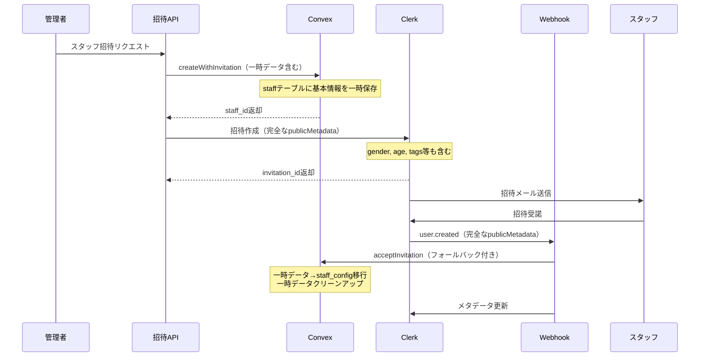

# スタッフ招待システム 
sequenceDiagram
    participant A as 管理者（フロントエンド）
    participant B as POST /api/clerk/staff/invite
    participant C as Convex（staff作成）
    participant D as Clerk（招待送信）
    participant E as スタッフ（メール受信者）

    A->>B: 招待リクエスト送信
    note over A,B: {email, tenant_id, org_id, role, name, gender, age, etc.}
    
    B->>B: 認証・バリデーション
    B->>C: createWithInvitation実行
    note over B,C: clerk_user_id=null, is_active=false
    
    C-->>B: staff_id返却
    B->>D: Clerk招待作成
    note over B,D: publicMetadataにstaff_id含める
    
    alt Clerk招待成功
        D-->>B: invitation_id返却
        B-->>A: 成功レスポンス
        D->>E: 招待メール送信
    else Clerk招待失敗
        B->>C: cancelInvitation（ロールバック）
        B-->>A: エラーレスポンス
    end


## 📋 修正概要

スタッフ招待システムにおけるメタデータの不整合問題を根本的に解決し、招待プロセスの安定性と信頼性を向上させました。

## 🚨 修正前の問題点

### 1. 初回招待時のメタデータ不足
- **問題**: `gender`、`age`、`instagram_link`、`tags`などの基本情報がClerkのpublicMetadataに含まれていない
- **影響**: webhook処理時にこれらの値がundefinedとなり、不完全なstaff_configレコードが作成される

### 2. Convexでの一時データ管理不備
- **問題**: 招待中のスタッフ基本情報がConvexに適切に保存されていない
- **影響**: 再送時や招待受諾時にデータが失われる可能性

### 3. 再送処理でのデータ復元不具合
- **問題**: 初回招待時に`staff_config`が存在しないため、再送時にundefinedメタデータが生成される
- **影響**: 再送後の招待受諾時にデータが不完全になる

### 4. Webhook処理でのフォールバック機能不備
- **問題**: publicMetadataが不完全な場合のフォールバック処理が不十分
- **影響**: データの整合性が保たれず、エラーが発生する可能性

## ✅ 実施した修正

### 1. 初回招待時のpublicMetadata完全化

**修正ファイル**: `/app/api/clerk/staff/invite/route.ts`

```typescript
// 修正前（不完全）
publicMetadata: {
  tenant_id,
  org_id,
  role,
  staff_id: result.staffId,
  ...(result.preConfig.extra_charge !== undefined && { extra_charge: result.preConfig.extra_charge }),
  ...(result.preConfig.priority !== undefined && { priority: result.preConfig.priority }),
  invited_by: userId,
  invited_at: new Date().toISOString()
}

// 修正後（完全）
publicMetadata: {
  tenant_id,
  org_id,
  role,
  staff_id: result.staffId,
  // スタッフ基本情報（webhook処理で必要）
  gender,
  ...(age !== null && age !== undefined && { age }),
  ...(instagram_link && { instagram_link }),
  tags: tags || [],
  // 事前設定情報
  ...(result.preConfig.extra_charge !== undefined && { extra_charge: result.preConfig.extra_charge }),
  ...(result.preConfig.priority !== undefined && { priority: result.preConfig.priority }),
  invited_by: userId,
  invited_at: new Date().toISOString()
}
```

**効果**: webhook処理時に必要な全ての情報が確実にpublicMetadataから取得可能

### 2. Convexでの一時的スタッフ情報保存機能

**修正ファイル**: 
- `/convex/schema.ts`
- `/convex/staff/invitation/mutation.ts`
- `/convex/staff/invitation/query.ts`

#### 2.1 スキーマ修正

```typescript
// staff テーブルに一時フィールドを追加
const staff = defineTable({
  // 既存フィールド...
  // 一時的な招待情報（招待受諾時にstaff_configに移行される）
  temp_email: v.optional(v.string()),
  temp_gender: v.optional(genderType),
  temp_age: v.optional(v.number()),
  temp_instagram_link: v.optional(v.string()),
  temp_tags: v.optional(v.array(v.string())),
  ...CommonFields,
})
```

#### 2.2 招待レコード作成時の一時保存

```typescript
// createWithInvitation 修正
const staffId = await createRecord(ctx, 'staff', {
  tenant_id: args.tenant_id,
  org_id: args.org_id,
  clerk_user_id: undefined,
  name: args.name,
  description: args.description,
  images: [],
  is_active: false,
  // 一時的な基本情報保存
  temp_email: args.email,
  temp_gender: args.gender,
  temp_age: args.age,
  temp_instagram_link: args.instagram_link,
  temp_tags: args.tags,
});
```

#### 2.3 招待受諾時のデータ移行とクリーンアップ

```typescript
// acceptInvitation 修正
await updateRecord(ctx, args.staff_id, {
  clerk_user_id: args.clerk_user_id,
  is_active: true,
  // 一時的なデータをクリア
  temp_email: undefined,
  temp_gender: undefined,
  temp_age: undefined,
  temp_instagram_link: undefined,
  temp_tags: undefined,
});

await createRecord(ctx, 'staff_config', {
  // publicMetadataから取得、フォールバックとして一時保存データを使用
  gender: args.gender || staff.temp_gender!,
  age: args.age !== undefined ? args.age : staff.temp_age,
  instagram_link: args.instagram_link || staff.temp_instagram_link,
  tags: (args.tags && args.tags.length > 0) ? args.tags : (staff.temp_tags || []),
  // その他の設定...
});
```

**効果**: 
- 招待中のデータが確実に保存される
- 招待受諾時にデータが適切にstaff_configに移行される
- メモリリークを防ぐためのクリーンアップが実行される

### 3. 再送処理でのメタデータ復元機能

**修正ファイル**: `/app/api/clerk/staff/invitations/route.ts`

#### 3.1 完全なスタッフデータ取得

```typescript
// 修正前（不完全なデータ取得）
const staffData = await convex.query(api.staff.invitation.query.getStaffWithInvitation, {
  staff_id: staff_id as Id<"staff">,
})

// 修正後（一時データも含む完全なデータ取得）
const staffData = await convex.query(api.staff.invitation.query.getCompleteStaffData, {
  staff_id: staff_id as Id<"staff">,
})
```

#### 3.2 フォールバック付きメタデータ構築

```typescript
publicMetadata: {
  tenant_id: staffData.tenant_id,
  org_id: staffData.org_id,
  role: staffData.config?.role || 'staff',
  staff_id: staffData._id,
  // フォールバック機能付きの基本情報設定
  gender: staffData.config?.gender || staffData.tempData?.gender,
  age: staffData.config?.age || staffData.tempData?.age,
  instagram_link: staffData.config?.instagram_link || staffData.tempData?.instagram_link,
  tags: staffData.config?.tags || staffData.tempData?.tags || [],
  // その他の設定...
}
```

**効果**: 
- staff_configが存在しない場合でも一時保存データから復元可能
- 再送時のメタデータが常に完全な状態で送信される

### 4. Webhook処理でのフォールバック機能

**修正ファイル**: `/services/webhook/clerk/handlers.ts`

#### 4.1 詳細ログ出力

```typescript
console.log(`📋 [${eventId}] publicMetadataから取得した情報:`, {
  staff_id,
  tenant_id,
  org_id,
  role,
  gender,
  age,
  instagram_link,
  tags: tags.length,
  extra_charge,
  priority
});
```

#### 4.2 フォールバック処理

```typescript
// 基本情報が不足している場合のフォールバック処理
if (!gender) {
  console.log(`⚠️ [${eventId}] publicMetadataにgenderが不足、一時保存データから取得を試行`);
  
  try {
    const staffData = await fetchQuery(deps.convex.staff.invitation.query.getCompleteStaffData, {
      staff_id: staff_id as Id<"staff">,
    });
    
    if (staffData?.tempData) {
      finalGender = gender || staffData.tempData.gender;
      finalAge = age !== undefined ? age : staffData.tempData.age;
      finalInstagramLink = instagram_link || staffData.tempData.instagram_link;
      finalTags = tags.length > 0 ? tags : (staffData.tempData.tags || []);
    }
  } catch (fallbackError) {
    // エラー処理とSentry通知
  }
}
```

**効果**: 
- publicMetadataが不完全でも一時保存データから復元
- 詳細なログ出力によりデバッグが容易
- エラー監視とアラート機能

## 🔍 データフロー図（修正後）



## 📊 修正効果の検証項目

### 1. 初回招待
- [ ] publicMetadataに全必要情報が含まれる
- [ ] Convexに一時データが正しく保存される
- [ ] webhook処理が正常に完了する
- [ ] staff_configレコードが完全に作成される

### 2. 招待再送
- [ ] 一時保存データから情報が復元される
- [ ] 再送メタデータが完全である
- [ ] 再送後の受諾処理が正常に動作する

### 3. データ整合性
- [ ] 招待受諾後にstaff_configが完全である
- [ ] 一時データが適切にクリーンアップされる
- [ ] 複数回の再送でもデータが保持される

### 4. エラーハンドリング
- [ ] フォールバック処理が適切に動作する
- [ ] エラー時のログ出力が詳細である
- [ ] Sentryアラートが適切に送信される

## 🚀 今後の改善提案

### 1. データ検証機能の強化
```typescript
// publicMetadata検証機能
const validateInvitationMetadata = (metadata: any) => {
  const required = ['tenant_id', 'org_id', 'staff_id', 'gender'];
  const missing = required.filter(key => !metadata[key]);
  if (missing.length > 0) {
    throw new Error(`必須メタデータが不足: ${missing.join(', ')}`);
  }
};
```

### 2. 自動修復機能
```typescript
// 不整合データの自動修復
const repairInconsistentData = async () => {
  // 招待中だがstaff_configが存在するケース
  // 一時データが残存しているケース
  // publicMetadataとConvexデータの不一致ケース
};
```

### 3. 監視ダッシュボード
- 招待成功率の監視
- メタデータ不整合の検出と通知
- パフォーマンス指標の追跡

## 📝 運用上の注意点

### 1. データベース移行
- **新しいスキーマ**: 既存のstaffレコードにはtemp_*フィールドがnullになる
- **互換性**: 既存の招待は従来通り動作するが、新機能の恩恵は受けられない

### 2. Clerk設定
- publicMetadataのサイズ制限に注意
- 招待リンクの有効期限設定の確認

### 3. 監視とアラート
- 新しいログ出力パターンの監視設定
- フォールバック処理の頻度監視
- エラー率の継続的な監視

## 🎯 結論

この修正により、スタッフ招待システムのメタデータ不整合問題が根本的に解決され、以下の効果が期待できます：

1. **信頼性の向上**: 招待プロセスでのデータ損失リスクの排除
2. **安定性の向上**: webhook処理エラーの大幅な削減
3. **保守性の向上**: 詳細なログとフォールバック機能による運用負荷軽減
4. **拡張性の確保**: 将来的な機能追加に対応できる柔軟な設計

これらの修正により、美容サロン向けSaaS「Bocker」のスタッフ管理機能が、より安定して動作するようになります。

---
**最終更新**: 2025年6月7日  
**修正担当**: システム設計チーム  
**レビュー**: 必要