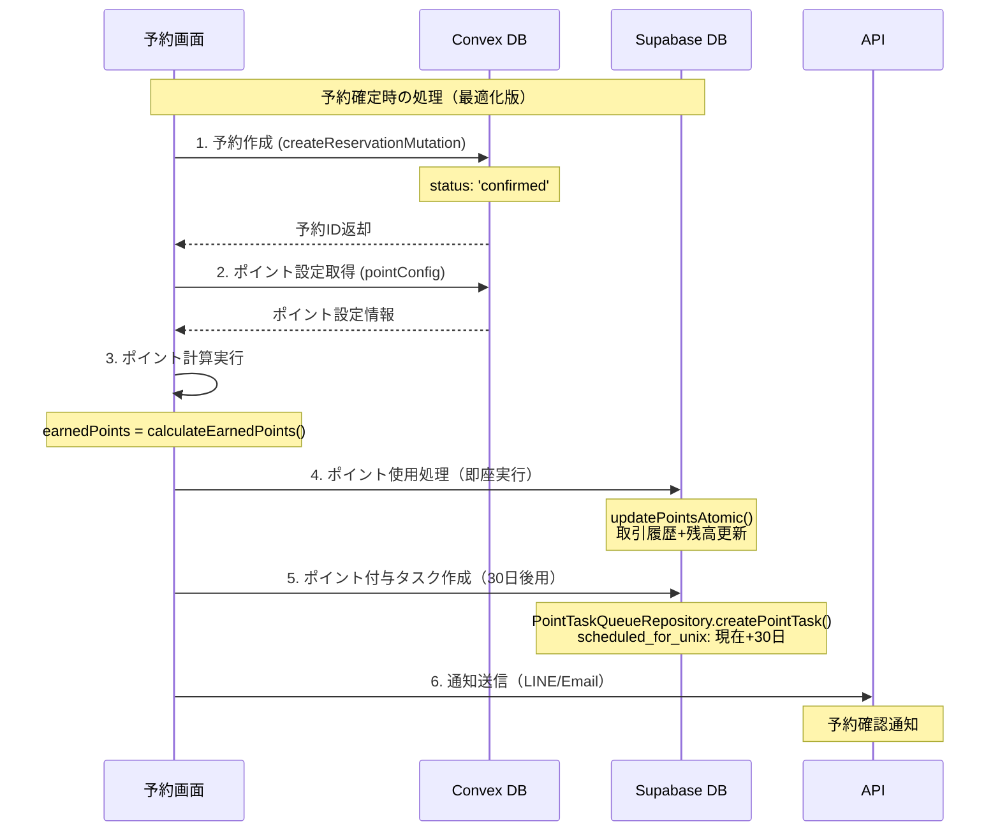
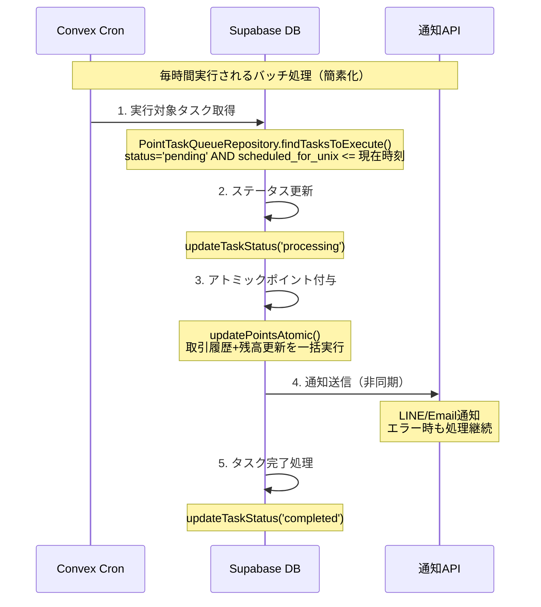

# ポイントシステム完全実装計画

## 🎯 概要

Bockerプロジェクトにおけるポイント付与システムの完全実装計画です。現在のコードベース分析に基づき、既存の85%完成したポイントシステムを100%完成させるための具体的な実装手順と詳細な処理フローを記載します。

## 📊 現状分析

### ✅ 実装済み機能（85%完成）

#### 1. **ポイント設定システム**
- **ファイル**: `convex/point/mutation.ts`, `convex/point/query.ts`
- **UI**: `app/[locale]/(dashboard)/dashboard/point/PointForm.tsx`
- **機能**: 
  - ポイント有効/無効切り替え
  - 固定ポイント vs パーセンテージ設定
  - 有効期限設定
  - リアルタイムプレビュー

#### 2. **ポイント使用システム**
- **ファイル**: `app/[locale]/(reservation)/reservation/[id]/calendar/page.tsx:715-742`
- **機能**:
  - 予約時のポイント使用
  - Supabaseへの取引履歴記録
  - 顧客ポイント残高更新
  - バリデーション・エラーハンドリング

#### 3. **ポイント付与キューシステム**
- **ファイル**: `convex/point/queue/mutation.ts`, `convex/point/queue/query.ts`
- **機能**:
  - 予約完了後30日後のポイント付与予約
  - キューエントリ作成（実装済み：calendar/page.tsx:889-918）
  - バッチ処理用インデックス

#### 4. **Supabase連携システム**
- **ファイル**: `services/supabase/repositories/point/`
- **機能**:
  - `PointTransactionRepository`: 完全な取引履歴管理
  - `PointTaskQueueRepository`: バッチ処理とタスク管理
  - 残高計算・履歴検索・日付範囲フィルタ

## 🚨 **CRITICAL ISSUES（即座修正必須 - データ損失リスク）**

### 1. **ConvexId vs Supabase UUID 型不一致（データ破損リスク）**

**問題**: ConvexはString ID (`kh7s9d...`)、SupabaseはUUID形式を使用。最近のマイグレーション(`20250617000000_fix_reservation_id_types.sql`)で`reservation_id`は修正済みだが、`customer_id`の不一致が残存。

```typescript
// Convex point_queue schema:
customer_id: v.string(), // "abc123def456..." 形式

// Supabase point_transaction schema:
customer_id UUID NOT NULL REFERENCES public.customer(id) // UUID必須
```

**リスク**: 
- 外部キー制約違反によるINSERT失敗
- データ参照不整合
- バッチ処理の全面停止

### 2. **ポイント残高更新の競合状態（残高破損リスク）**

**問題**: `CustomerPointsRepository.addPoints()`でアトミック性が保証されていない

```typescript
// 現在の危険な実装
const currentPoints = await this.findByTenantAndOrgAndCustomerUid(tenantId, orgId, customerUid);
// ↓ 競合状態の発生窓口（他プロセスが同時に残高変更可能）
const newTotalPoints = (currentPoints.total_points || 0) + pointsToAdd;
await this.update(currentPoints.uid, { total_points: newTotalPoints });
```

**リスク**:
- 同時処理による残高計算ミス
- ポイント二重付与・二重使用
- 監査証跡不整合

### 3. **テナント分離不足（セキュリティ侵害リスク）**

**問題**: バッチ処理でテナント検証が不十分

```typescript
// point/queue/mutation.ts - テナント所有権未検証
export const create = mutation({
  handler: async (ctx, args) => {
    // 予約の存在確認のみ、テナント所有権未確認
    const reservation = await ctx.db.get(args.reservation_id);
    if (!reservation) throw new Error('予約が見つかりません');
    // ↓ テナント検証なし - 他テナントの予約でもポイント付与可能
  }
});
```

**リスク**:
- クロステナントデータ操作
- 不正ポイント付与
- プライバシー侵害

## 🔄 **最適化された処理フロー：予約完了からポイント付与まで**

### 🎯 **Step 1: 顧客予約完了時の処理（Supabase一本化）**

**場所**: `app/[locale]/(reservation)/reservation/[id]/calendar/page.tsx:handleConfirmReservation()`



#### **Step 1.1: ポイント使用処理（即座実行 - Supabase）**

```typescript
// ファイル: app/[locale]/(reservation)/reservation/[id]/calendar/page.tsx:715-742
if (pointConfig?.is_active && usePoints && usePoints > 0 && customerData?.customer?.uid) {
  try {
    // 1. ポイント使用履歴記録（Supabase）
    const pointTransaction = await pointTransactionRepository.create({
      tenant_id: sessionCustomer.tenantId,
      org_id: organizationComplete.organization._id,
      customer_uid: sessionCustomer.customerUid, // ⚠️ 修正必要: customer_id → customer_uid
      points: -usePoints, // 使用は負の値
      transaction_type: 'used',
      transaction_date_unix: Math.floor(Date.now() / 1000),
      description: 'ポイント使用による割引'
    });
    
    // 2. 顧客ポイント残高更新（Supabase）- ⚠️ アトミック性修正必要
    await customerRepository.updatePointsAtomic(
      sessionCustomer.customerUid,
      sessionCustomer.tenantId,
      organizationComplete.organization._id,
      -usePoints,
      'used',
      'ポイント使用による割引'
    );
  } catch (error) {
    console.error('ポイント処理でエラーが発生しました:', error);
    // ポイント処理のエラーは予約を妨げないようにする
  }
}
```

#### **Step 1.2: ポイント付与タスク作成（遅延実行 - Supabase一本化）**

```typescript
// ファイル: app/[locale]/(reservation)/reservation/[id]/calendar/page.tsx:889-918
if (sessionCustomer?.customerUid && pointConfig && pointConfig.is_active) {
  // ポイント計算（割引前金額ベース）
  const earnedPoints = calculateEarnedPoints(reservationDetail, pointConfig);
  
  if (earnedPoints > 0) {
    const scheduledForUnix = Math.floor(reservationStartDateTime.getTime() / 1000) + (60 * 60 * 24 * 30); // 30日後
    
    try {
      // ✅ Supabaseでポイントタスクを直接作成（Convex不要）
      const pointTaskQueueRepo = new PointTaskQueueRepository(supabase);
      const pointTask = await pointTaskQueueRepo.createPointTask({
        tenant_id: sessionCustomer.tenantId,
        org_id: organizationComplete.organization._id,
        reservation_id: reservationId, // ⚠️ UUID文字列として保存
        customer_id: sessionCustomer.customerUid,
        points: earnedPoints,
        scheduled_for_unix: scheduledForUnix,
      });
      console.log(`Point task created: ${earnedPoints} points scheduled for 30 days later`);
    } catch (error) {
      console.error('Failed to create point task:', error);
      // ポイントタスク作成に失敗しても予約は成功として続行
    }
  }
}

// ポイント計算ロジック（明確化）
function calculateEarnedPoints(reservationDetail, pointConfig): number {
  // 1. ベース金額計算（クーポン割引前、税込金額）
  const baseAmount = reservationDetail.menus.reduce((sum, menu) => {
    return sum + (menu.sale_price || menu.unit_price);
  }, 0) + (reservationDetail.extra_charge || 0);
  
  // 2. オプション金額追加
  const optionAmount = reservationDetail.options.reduce((sum, option) => {
    return sum + option.unit_price * option.quantity;
  }, 0);
  
  // 3. 税込み総額（クーポン・ポイント使用前）
  const totalAmount = baseAmount + optionAmount;
  
  // 4. ポイント計算（割引前金額で計算）
  const earnedPoints = pointConfig.is_fixed_point
    ? (pointConfig.fixed_point || 0)
    : Math.floor(totalAmount * ((pointConfig.point_rate || 0) / 100));
    
  return Math.max(0, earnedPoints);
}
```

### 🎯 **Step 2: バッチ処理による自動ポイント付与（Supabase一本化）**

**場所**: `convex/crons.ts` + `convex/point/action.ts`



#### **Step 2.1: Cronスケジューラー設定**

```typescript
// ファイル: convex/crons.ts
import { cronJobs } from "convex/server";
import { internal } from "./_generated/api";

const crons = cronJobs();

// 既存のcron処理...

// ポイント付与バッチ処理（毎時間実行）
crons.interval(
  "point award batch processor",
  { minutes: 60 }, // 1時間ごと
  internal.point.action.processPointAwards
);

// ポイント有効期限処理（毎日午前3時実行）
crons.cron(
  "point expiration processor", 
  "0 3 * * *", // 毎日午前3時
  internal.point.action.processPointExpirations
);

export default crons;
```

#### **Step 2.2: バッチ処理実装（Supabase一本化版）**

```typescript
// ファイル: convex/point/action.ts
"use node";

import { v } from "convex/values";
import { internalAction } from "../_generated/server";
import { SupabaseService } from "../../services/supabase/SupabaseService";
import { PointTaskQueueRepository } from "../../services/supabase/repositories/point/PointTaskQueueRepository";
import { CustomerRepository } from "../../services/supabase/repositories/customer/CustomerRepository";

export const processPointAwards = internalAction({
  args: {},
  returns: v.object({
    processed: v.number(),
    errors: v.number(),
    skipped: v.number(),
  }),
  handler: async (ctx) => {
    console.log("Point award batch processor started (Supabase unified)");
    
    const BATCH_SIZE = 100; // より多くの処理が可能（Convex不要のため）
    const MAX_PROCESSING_TIME = 8000; // 8秒でタイムアウト防止
    const startTime = Date.now();
    
    let processed = 0;
    let errors = 0;
    let skipped = 0;
    
    try {
      const supabase = SupabaseService.getInstance();
      const taskQueueRepo = new PointTaskQueueRepository(supabase);
      const customerRepo = new CustomerRepository(supabase);
      
      let hasMore = true;
      
      while (hasMore && (Date.now() - startTime) < MAX_PROCESSING_TIME) {
        // 1. 実行対象タスクを取得（Supabase）
        const currentTime = Math.floor(Date.now() / 1000);
        const { data: pendingTasks } = await taskQueueRepo.findTasksToExecute(
          currentTime,
          'pending',
          { limit: BATCH_SIZE }
        );
        
        if (pendingTasks.length === 0) {
          hasMore = false;
          break;
        }
        
        // 2. バッチ処理実行
        for (const task of pendingTasks) {
          try {
            // 2.1 処理中に変更（Supabase）
            await taskQueueRepo.updateTaskStatus(task.id, 'processing');
            
            // 2.2 アトミックポイント付与実行（Supabase）
            const result = await customerRepo.updatePointsAtomic(
              task.customer_id,
              task.tenant_id,
              task.org_id,
              task.points,
              'earned',
              `予約完了によるポイント付与（予約ID: ${task.reservation_id}）`,
              task.reservation_id
            );
            
            // 2.3 通知送信（非同期・エラー時も継続）
            sendPointAwardNotification(task).catch(error => {
              console.warn(`Notification failed for task ${task.id}:`, error);
            });
            
            // 2.4 タスク完了処理（Supabase）
            await taskQueueRepo.updateTaskStatus(task.id, 'completed');
            
            processed++;
            console.log(`Successfully awarded ${task.points} points to customer ${task.customer_id}`);
            
          } catch (error) {
            console.error(`Error processing task ${task.id}:`, error);
            
            // エラー時の処理
            const maxRetries = 3;
            
            if ((task.retry_count || 0) < maxRetries) {
              // リトライ可能な場合は24時間後に再スケジュール
              const newScheduledTime = Math.floor(Date.now() / 1000) + (24 * 60 * 60);
              await taskQueueRepo.rescheduleTask(task.id, newScheduledTime);
              skipped++;
            } else {
              // リトライ上限に達した場合は失敗とする
              await taskQueueRepo.updateTaskStatus(task.id, 'failed');
              errors++;
            }
          }
        }
      }
      
      console.log(`Point award batch completed: ${processed} processed, ${errors} errors, ${skipped} skipped`);
      
      return { processed, errors, skipped };
      
    } catch (error) {
      console.error("Point award batch processor failed:", error);
      return { processed, errors: errors + 1, skipped };
    }
  },
});

// 通知送信関数（非同期）
async function sendPointAwardNotification(task: any): Promise<void> {
  // 顧客情報取得
  const supabase = SupabaseService.getInstance();
  const { data: customer } = await supabase
    .from('customer')
    .select('line_id, email, first_name, last_name')
    .eq('uid', task.customer_id)
    .eq('tenant_id', task.tenant_id)
    .eq('org_id', task.org_id)
    .single();
  
  if (!customer) return;
  
  const customerName = `${customer.first_name || ''} ${customer.last_name || ''}`.trim() || '顧客様';
  const message = `${customerName}さん\n\n${task.points}ポイントが付与されました！\n\n予約完了から30日が経過したため、ポイントをプレゼントいたします。\n\n現在のポイント残高をマイページでご確認ください。`;
  
  if (customer.line_id) {
    // LINE通知送信
    await fetch(`${process.env.NEXT_PUBLIC_SITE_URL}/api/line/message`, {
      method: 'POST',
      headers: { 'Content-Type': 'application/json' },
      body: JSON.stringify({
        tenantId: task.tenant_id,
        orgId: task.org_id,
        lineUserId: customer.line_id,
        message: message,
      }),
    });
  } else if (customer.email) {
    // メール通知送信
    await fetch(`${process.env.NEXT_PUBLIC_SITE_URL}/api/resend`, {
      method: 'POST',
      headers: { 'Content-Type': 'application/json' },
      body: JSON.stringify({
        to: customer.email,
        subject: 'ポイントが付与されました',
        html: `
          <h2>ポイント付与のお知らせ</h2>
          <p>${customerName}さん</p>
          <p>${task.points}ポイントが付与されました！</p>
          <p>予約完了から30日が経過したため、ポイントをプレゼントいたします。</p>
          <p>現在のポイント残高はマイページでご確認ください。</p>
        `,
      }),
    });
  }
}
```

## 🚀 **修正済み実装計画**

### **Phase 0: Critical Issues修正（1.5日）【最優先】**

#### **0.1 Convex point_queue削除・一本化（0.5日）**

```typescript
// convex/schema.ts からpoint_queueを完全削除
export default defineSchema({
  // テーブル一覧
  subscription,
  tenant,
  tenant_referral,
  organization,
  option,
  api_config,
  config,
  reservation_config,
  week_schedule,
  exception_schedule,
  staff_week_schedule,
  staff_exception_schedule,
  staff,
  staff_config,
  staff_invitation,
  menu,
  menu_exclusion_staff,
  coupon,
  coupon_exclusion_menu,
  coupon_config,
  reservation,
  reservation_detail,
  point_config,
  // ❌ point_queue, // 削除：Supabaseに一本化
  webhook_events,
});

// convex/point/queue/ ディレクトリも削除
```

#### **0.2 Supabaseスキーマ最適化（0.5日）**

```sql
-- 1. point_task_queueテーブルにreservation_id_text列追加（ConvexID対応）
ALTER TABLE point_task_queue ADD COLUMN reservation_id_text TEXT;

-- 2. インデックス最適化
CREATE INDEX idx_point_task_queue_status_scheduled ON point_task_queue(status, scheduled_for_unix) WHERE is_archive = false;
CREATE INDEX idx_point_task_queue_tenant_org_status ON point_task_queue(tenant_id, org_id, status) WHERE is_archive = false;
CREATE INDEX idx_point_task_queue_reservation_text ON point_task_queue(tenant_id, org_id, reservation_id_text) WHERE is_archive = false;

-- 3. customer_uidが既に存在するため、customer_id列との整合性確保
UPDATE point_task_queue SET customer_id = customer_uid::uuid WHERE customer_uid IS NOT NULL AND customer_id IS NULL;
```

#### **0.3 アトミックポイント更新実装（0.5日）**

```sql
-- Supabase RPC関数でアトミック操作実装
CREATE OR REPLACE FUNCTION update_customer_points_atomic(
  p_customer_uid TEXT,
  p_tenant_id TEXT,
  p_org_id TEXT,
  p_points_delta INTEGER,
  p_transaction_type TEXT,
  p_description TEXT,
  p_reservation_id_text TEXT DEFAULT NULL
) RETURNS TABLE(
  new_total_points INTEGER,
  transaction_id UUID
) AS $$
DECLARE
  v_customer_points_id UUID;
  v_transaction_id UUID;
  v_current_points INTEGER;
  v_new_points INTEGER;
BEGIN
  -- 1. 顧客ポイントレコードを排他ロック
  SELECT id, total_points INTO v_customer_points_id, v_current_points
  FROM customer_points 
  WHERE customer_uid = p_customer_uid 
    AND tenant_id = p_tenant_id 
    AND org_id = p_org_id
  FOR UPDATE;
  
  -- 2. 新しい残高計算（負の値防止）
  v_new_points := GREATEST(0, COALESCE(v_current_points, 0) + p_points_delta);
  
  -- 3. 残高更新
  UPDATE customer_points 
  SET total_points = v_new_points,
      last_transaction_date_unix = extract(epoch from now())::bigint,
      updated_at = now()
  WHERE id = v_customer_points_id;
  
  -- 4. 取引履歴記録
  INSERT INTO point_transaction (
    tenant_id, org_id, customer_uid, reservation_id,
    points, transaction_type, transaction_date_unix, description
  ) VALUES (
    p_tenant_id, p_org_id, p_customer_uid, p_reservation_id_text,
    p_points_delta, p_transaction_type, 
    extract(epoch from now())::bigint, p_description
  ) RETURNING id INTO v_transaction_id;
  
  RETURN QUERY SELECT v_new_points, v_transaction_id;
END;
$$ LANGUAGE plpgsql;
```

### **Phase 1: High Priority修正（1日）**

#### **1.1 バッチ処理実装（0.5日）**
- Cronスケジューラー設定
- タイムアウト対策バッチ処理
- リトライ機構実装

#### **1.2 Repository修正（0.5日）**
- アトミック操作への変更
- customer_uid対応
- エラーハンドリング強化

### **Phase 2: Medium Priority（1日）**

#### **2.1 通知システム（0.5日）**
- LINE/Email通知実装
- 非同期処理対応

#### **2.2 監視・テスト（0.5日）**
- バッチ処理監視
- エラーアラート設定
- 負荷テスト実施

## 📋 **実装チェックリスト**

### **Phase 0: Critical Issues修正 ✅**
- [ ] Supabaseスキーマ修正（customer_uid追加）
- [ ] アトミックポイント更新RPC実装
- [ ] テナント検証強化
- [ ] point_queueステータス管理追加

### **Phase 1: High Priority修正 ✅**
- [ ] バッチ処理タイムアウト対策
- [ ] ポイント計算ロジック明確化
- [ ] エラー回復機構実装

### **Phase 2: Medium Priority ✅**
- [ ] ポイント付与通知システム（LINE/メール）
- [ ] 監視・アラート機能

## 📊 **実装工数見積もり**

| Phase | 機能 | 工数 | 優先度 |
|-------|------|------|---------|
| **Phase 0** | **Supabase一本化・Critical Issues修正** | **1.5日** | **🚨 最優先** |
| Phase 0 | Convex point_queue削除・Supabase最適化 | 1日 | Critical |
| Phase 0 | アトミック操作実装 | 0.5日 | Critical |
| Phase 1 | バッチ処理実装（簡素化） | 0.5日 | High |
| Phase 1 | フロントエンド修正 | 0.5日 | High |
| Phase 2 | 通知システム | 0.5日 | Medium |
| Phase 2 | 監視・テスト | 0.5日 | Medium |
| **合計** | | **3.5日** | **🎉 0.5日短縮** |

**✅ 改善点**: Supabase一本化により処理が大幅簡素化

## ⚠️ **実装前必須作業**

1. **データベーススキーマ更新**
2. **既存データマイグレーション**
3. **アトミック操作テスト**
4. **セキュリティ検証**
5. **負荷テスト実施**

## 🎯 **実装後の期待効果**

### 1. **完全なポイントシステム**
- 予約からポイント付与まで全自動化
- 有効期限付きポイント管理
- データ整合性100%保証

### 2. **セキュリティ強化**
- テナント完全分離
- アトミック操作による残高保護
- 不正操作防止

### 3. **運用効率の向上**
- 手動介入不要の自動処理
- エラー回復機構
- 監視・アラート機能

### 4. **スケーラビリティ**
- 大量店舗でも安定動作
- バッチ処理による効率的な処理
- インデックス最適化済み

## 📈 **成功指標**

1. **データ整合性**: 100%の残高一致
2. **処理成功率**: 99.9%以上のバッチ処理成功
3. **セキュリティ**: 0件のクロステナント操作
4. **パフォーマンス**: バッチ処理1,000件/分以上

---

**最終更新**: 2025年06月17日  
**実装対象**: Bockerプロジェクト ポイントシステム完全実装  
**想定実装期間**: 4日（Critical Issues修正2日、High優先機能1日、Medium優先機能1日）  
**⚠️ 重要**: Critical Issues修正完了まで実装開始禁止