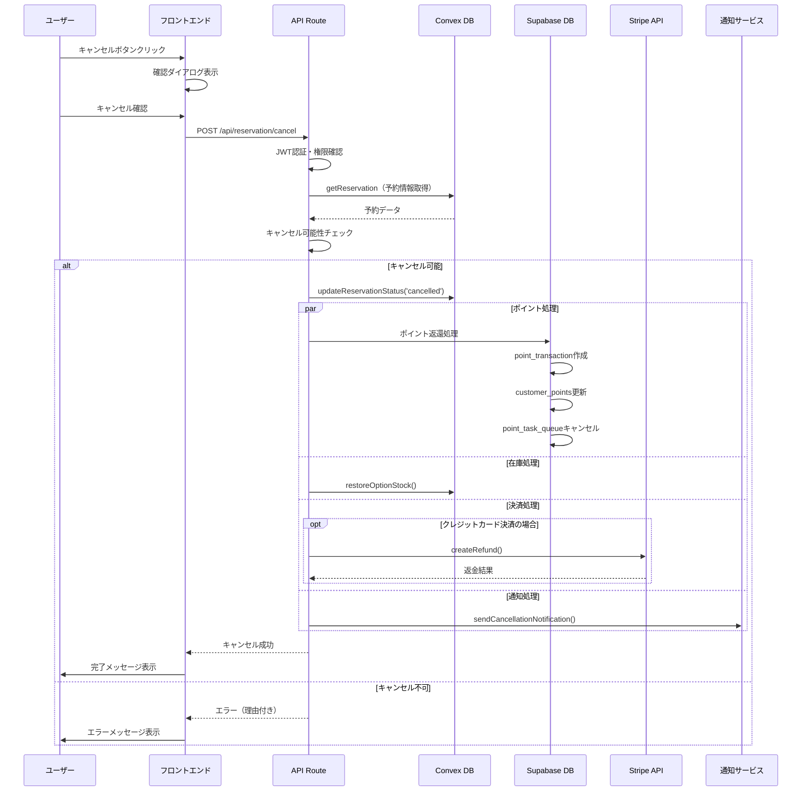

# 予約キャンセル実装ガイド

最終更新日: 2025年1月19日

## 1. 概要

このドキュメントは、Bocker（ブッカー）における予約キャンセル機能の実装ガイドです。予約キャンセルは単なるステータス変更ではなく、ポイント、在庫、決済、通知など複数のシステムに影響を与える複雑な処理です。本ガイドでは、データ整合性を保ちながら安全にキャンセル処理を実装するための包括的な指針を提供します。

### 1.1 キャンセル処理の影響範囲

```
予約キャンセル
├── Convex（リアルタイムDB）
│   ├── reservation: ステータス更新
│   ├── option: 在庫数の復元
│   └── reservation_detail: キャンセル情報記録
├── Supabase（履歴DB）
│   ├── point_transaction: ポイント返還記録
│   ├── point_task_queue: 予定ポイント付与のキャンセル
│   └── customer_points: ポイント残高更新
├── Stripe
│   └── 決済のキャンセル・返金処理
└── 通知
    ├── メール送信
    └── LINE送信
```

## 2. キャンセルポリシーと制約

### 2.1 キャンセル可能条件

```typescript
interface CancellationPolicy {
  // 組織設定
  available_cancel_days: number;  // キャンセル可能日数（予約日の何日前まで）
  
  // システム制約
  cancellableStatuses: ['confirmed', 'pending']; // キャンセル可能なステータス
  nonCancellableStatuses: ['completed', 'cancelled', 'refunded']; // キャンセル不可
  
  // 返金ポリシー
  refundPolicy: {
    cash: 'full_refund',           // 現金決済：全額返金（ポイント返還）
    credit_card: 'stripe_refund'   // カード決済：Stripe経由で返金
  };
}
```

### 2.2 キャンセル権限

| アクター | キャンセル可能な予約 | 期限制約 |
|---------|-------------------|---------|
| 顧客本人 | 自身の予約のみ | available_cancel_days に従う |
| スタッフ（Staff） | 自組織の全予約 | 制約なし（警告表示） |
| マネージャー（Manager） | 自組織の全予約 | 制約なし |
| オーナー（Owner） | 自組織の全予約 | 制約なし |

## 3. データフロー

### 3.1 キャンセル処理の全体フロー



## 4. 実装詳細

### 4.1 Convex側の実装

#### 4.1.1 予約キャンセルMutation

```typescript
// convex/reservation/mutation.ts

export const cancelReservation = mutation({
  args: {
    reservationId: v.id("reservation"),
    cancelledBy: v.string(), // 'customer' | 'staff' | 'system'
    cancelReason: v.optional(v.string()),
    skipValidation: v.optional(v.boolean()), // スタッフ用：期限チェックスキップ
  },
  handler: async (ctx, args) => {
    const reservation = await ctx.db.get(args.reservationId);
    
    if (!reservation || reservation.is_archive) {
      throw new Error("Reservation not found");
    }
    
    // ステータスチェック
    if (!['confirmed', 'pending'].includes(reservation.status)) {
      throw new Error(`Cannot cancel reservation with status: ${reservation.status}`);
    }
    
    // キャンセル期限チェック（顧客の場合のみ）
    if (args.cancelledBy === 'customer' && !args.skipValidation) {
      const org = await ctx.db
        .query("organization_reservation_config")
        .withIndex("by_tenant_org_archive")
        .filter(q => 
          q.and(
            q.eq(q.field("tenant_id"), reservation.tenant_id),
            q.eq(q.field("org_id"), reservation.org_id),
            q.eq(q.field("is_archive"), false)
          )
        )
        .first();
      
      const cancelDeadline = reservation.start_time_unix - 
        (org?.available_cancel_days || 1) * 24 * 60 * 60 * 1000;
      
      if (Date.now() > cancelDeadline) {
        throw new Error("Cancellation deadline has passed");
      }
    }
    
    // ステータス更新
    await ctx.db.patch(args.reservationId, {
      status: 'cancelled',
      cancelled_at: Date.now(),
      cancelled_by: args.cancelledBy,
      cancel_reason: args.cancelReason,
      updated_at: Date.now(),
    });
    
    // 予約詳細も更新
    const details = await ctx.db
      .query("reservation_detail")
      .withIndex("by_reservation_archive")
      .filter(q =>
        q.and(
          q.eq(q.field("reservation_id"), args.reservationId),
          q.eq(q.field("is_archive"), false)
        )
      )
      .first();
    
    if (details) {
      await ctx.db.patch(details._id, {
        cancellation_info: {
          cancelled_at: Date.now(),
          cancelled_by: args.cancelledBy,
          reason: args.cancelReason,
        },
        updated_at: Date.now(),
      });
    }
    
    return { success: true, reservation };
  },
});
```

#### 4.1.2 オプション在庫復元

```typescript
// convex/option/mutation.ts に追加

export const restoreStockForCancelledReservation = internalMutation({
  args: {
    reservationDetailId: v.id("reservation_detail"),
  },
  handler: async (ctx, args) => {
    const detail = await ctx.db.get(args.reservationDetailId);
    if (!detail) return;
    
    const restoreOperations = [];
    
    // オプションの在庫を復元
    if (detail.options && Array.isArray(detail.options)) {
      for (const opt of detail.options) {
        if (opt.id && opt.quantity) {
          const option = await ctx.db.get(opt.id);
          if (option && option.in_stock !== null) {
            restoreOperations.push(
              ctx.db.patch(opt.id, {
                in_stock: option.in_stock + opt.quantity,
                updated_at: Date.now(),
              })
            );
          }
        }
      }
    }
    
    await Promise.all(restoreOperations);
    
    return { 
      success: true, 
      restoredCount: restoreOperations.length 
    };
  },
});
```

### 4.2 Supabase側の実装

#### 4.2.1 ポイント返還処理

```typescript
// services/supabase/repositories/point/PointTransactionRepository.ts

export class PointTransactionRepository extends BaseRepository {
  /**
   * 予約キャンセルに伴うポイント返還
   */
  async refundPointsForCancellation(params: {
    customerId: string;
    reservationId: string;
    refundPoints: number;
    tenantId: string;
    orgId: string;
  }): Promise<OperationResult<void>> {
    try {
      // トランザクション開始
      const { data: customer, error: fetchError } = await this.client
        .from('customer_points')
        .select('*')
        .eq('customer_uid', params.customerId)
        .single();
      
      if (fetchError || !customer) {
        throw new Error('Customer points record not found');
      }
      
      // ポイント返還トランザクション作成
      const { error: transactionError } = await this.client
        .from('point_transaction')
        .insert({
          tenant_id: params.tenantId,
          org_id: params.orgId,
          customer_id: params.customerId,
          reservation_id: params.reservationId,
          points: params.refundPoints,
          transaction_type: 'refund',
          transaction_date_unix: Date.now(),
          description: `予約キャンセルによるポイント返還 (予約ID: ${params.reservationId})`,
        });
      
      if (transactionError) throw transactionError;
      
      // ポイント残高を原子的に更新
      const { error: updateError } = await this.client
        .rpc('update_customer_points_atomic', {
          p_customer_uid: params.customerId,
          p_points_delta: params.refundPoints,
        });
      
      if (updateError) throw updateError;
      
      return { success: true, data: undefined };
    } catch (error) {
      return this.handleError(error);
    }
  }
  
  /**
   * 予定されているポイント付与をキャンセル
   */
  async cancelPendingPointAward(
    reservationId: string
  ): Promise<OperationResult<void>> {
    try {
      const { error } = await this.client
        .from('point_task_queue')
        .update({ 
          status: 'cancelled',
          updated_at: new Date().toISOString(),
        })
        .eq('reservation_id', reservationId)
        .eq('status', 'pending');
      
      if (error) throw error;
      
      return { success: true, data: undefined };
    } catch (error) {
      return this.handleError(error);
    }
  }
}
```

### 4.3 API Route実装

```typescript
// app/api/reservation/cancel/route.ts

import { NextRequest, NextResponse } from 'next/server';
import { fetchMutation, fetchQuery } from '@/convex/nextjs';
import { api } from '@/convex/_generated/api';
import { Id } from '@/convex/_generated/dataModel';
import { verifyJWT } from '@/lib/auth/jwt';
import { StripeService } from '@/services/stripe/StripeService';
import { PointTransactionRepository } from '@/services/supabase/repositories/point';
import { sendCancellationNotification } from '@/lib/notifications';

export async function POST(request: NextRequest) {
  try {
    // 1. 認証確認
    const token = request.cookies.get('bocker_login_session')?.value;
    if (!token) {
      return NextResponse.json({ error: 'Unauthorized' }, { status: 401 });
    }
    
    const session = await verifyJWT(token);
    const body = await request.json();
    const { reservationId, reason, isStaffAction = false } = body;
    
    // 2. 予約情報取得
    const reservation = await fetchQuery(
      api.reservation.query.getById,
      { reservationId }
    );
    
    if (!reservation) {
      return NextResponse.json({ error: 'Reservation not found' }, { status: 404 });
    }
    
    // 3. 権限確認
    if (!isStaffAction && reservation.customer_id !== session.customerUid) {
      return NextResponse.json({ error: 'Forbidden' }, { status: 403 });
    }
    
    // 4. 予約詳細取得（ポイント・決済情報のため）
    const reservationDetail = await fetchQuery(
      api.reservation.query.getDetailByReservationId,
      { reservationId }
    );
    
    // 5. Convexでステータス更新
    await fetchMutation(
      api.reservation.mutation.cancelReservation,
      {
        reservationId: reservationId as Id<"reservation">,
        cancelledBy: isStaffAction ? 'staff' : 'customer',
        cancelReason: reason,
        skipValidation: isStaffAction,
      }
    );
    
    // 6. 並列処理で関連データを更新
    const results = await Promise.allSettled([
      // 6.1 ポイント処理
      handlePointRefund(reservation, reservationDetail),
      
      // 6.2 在庫復元
      handleStockRestore(reservationDetail),
      
      // 6.3 決済キャンセル（クレジットカードの場合）
      handlePaymentRefund(reservation, reservationDetail),
      
      // 6.4 通知送信
      sendCancellationNotification({
        reservation,
        reservationDetail,
        customerEmail: session.email,
        customerName: reservation.customer_name,
        lineUserId: session.lineUserId,
      }),
    ]);
    
    // エラーチェック
    const errors = results
      .filter(r => r.status === 'rejected')
      .map(r => (r as PromiseRejectedResult).reason);
    
    if (errors.length > 0) {
      console.error('Cancellation side effects failed:', errors);
      // 部分的失敗でも、キャンセル自体は成功として扱う
      return NextResponse.json({
        success: true,
        warnings: errors.map(e => e.message || 'Unknown error'),
      });
    }
    
    return NextResponse.json({ success: true });
    
  } catch (error) {
    console.error('Reservation cancellation failed:', error);
    return NextResponse.json(
      { error: error instanceof Error ? error.message : 'Internal server error' },
      { status: 500 }
    );
  }
}

// ヘルパー関数

async function handlePointRefund(reservation: any, detail: any) {
  if (!detail?.use_points || detail.use_points <= 0) return;
  
  const pointRepo = new PointTransactionRepository();
  
  // 使用ポイントを返還
  await pointRepo.refundPointsForCancellation({
    customerId: reservation.customer_id,
    reservationId: reservation._id,
    refundPoints: detail.use_points,
    tenantId: reservation.tenant_id,
    orgId: reservation.org_id,
  });
  
  // 予定されていたポイント付与をキャンセル
  await pointRepo.cancelPendingPointAward(reservation._id);
}

async function handleStockRestore(detail: any) {
  if (!detail?._id) return;
  
  await fetchMutation(
    api.option.mutation.restoreStockForCancelledReservation,
    { reservationDetailId: detail._id }
  );
}

async function handlePaymentRefund(reservation: any, detail: any) {
  // クレジットカード決済でない場合はスキップ
  if (detail?.payment_method !== 'credit_card' || 
      !reservation.stripe_checkout_session_id) {
    return;
  }
  
  const stripeService = new StripeService();
  
  // Stripe返金処理
  await stripeService.createRefund({
    checkoutSessionId: reservation.stripe_checkout_session_id,
    amount: detail.total_price, // 全額返金
    reason: 'requested_by_customer',
    metadata: {
      reservation_id: reservation._id,
      cancelled_at: new Date().toISOString(),
    },
  });
}
```

### 4.4 通知テンプレート

#### 4.4.1 キャンセル確認メール

```typescript
// components/emails/ReservationCancellationEmail.tsx

import React from 'react';
import {
  Body,
  Container,
  Head,
  Heading,
  Html,
  Link,
  Preview,
  Section,
  Text,
} from '@react-email/components';

interface ReservationCancellationEmailProps {
  customerName: string;
  reservationDate: string;
  reservationTime: string;
  staffName: string;
  salonName: string;
  refundAmount?: number;
  refundMethod?: 'points' | 'credit_card';
}

export default function ReservationCancellationEmail({
  customerName,
  reservationDate,
  reservationTime,
  staffName,
  salonName,
  refundAmount,
  refundMethod,
}: ReservationCancellationEmailProps) {
  return (
    <Html>
      <Head />
      <Preview>予約キャンセルのお知らせ - {salonName}</Preview>
      <Body style={main}>
        <Container style={container}>
          <Heading style={h1}>予約キャンセルのお知らせ</Heading>
          
          <Text style={text}>
            {customerName} 様
          </Text>
          
          <Text style={text}>
            以下のご予約がキャンセルされました。
          </Text>
          
          <Section style={infoSection}>
            <Text style={infoLabel}>サロン名:</Text>
            <Text style={infoValue}>{salonName}</Text>
            
            <Text style={infoLabel}>予約日時:</Text>
            <Text style={infoValue}>{reservationDate} {reservationTime}</Text>
            
            <Text style={infoLabel}>担当スタッフ:</Text>
            <Text style={infoValue}>{staffName}</Text>
          </Section>
          
          {refundAmount && (
            <Section style={refundSection}>
              <Heading style={h2}>返金について</Heading>
              <Text style={text}>
                {refundMethod === 'points' 
                  ? `${refundAmount}ポイントがお客様のアカウントに返還されました。`
                  : `¥${refundAmount.toLocaleString()}が、ご利用のクレジットカードに返金処理されます。`
                }
              </Text>
              {refundMethod === 'credit_card' && (
                <Text style={smallText}>
                  ※ 返金の反映にはカード会社により3-5営業日かかる場合があります。
                </Text>
              )}
            </Section>
          )}
          
          <Text style={text}>
            ご不明な点がございましたら、サロンまでお問い合わせください。
          </Text>
          
          <Text style={footer}>
            このメールは自動送信されています。返信はできません。
          </Text>
        </Container>
      </Body>
    </Html>
  );
}

// スタイル定義...
```

## 5. エラーハンドリング

### 5.1 エラーパターンと対処

| エラーケース | 原因 | 対処方法 |
|------------|------|---------|
| キャンセル期限切れ | available_cancel_days を超過 | 顧客にはエラー表示、スタッフには警告後続行可 |
| 既にキャンセル済み | status が 'cancelled' | エラーメッセージ表示 |
| ポイント返還失敗 | Supabase接続エラー | ログ記録、手動対応フラグ設定 |
| 在庫復元失敗 | Convex更新エラー | リトライ、失敗時は手動対応 |
| 返金処理失敗 | Stripe APIエラー | エラーログ、サポート通知 |
| 通知送信失敗 | メール/LINE APIエラー | ログ記録のみ（処理は続行） |

### 5.2 ロールバック戦略

```typescript
// 部分的失敗時の補償トランザクション
interface CancellationRollback {
  // Convexのステータスは変更済み（ロールバック不要）
  // 以下は個別に補償処理を実行
  
  pointRefund: {
    retry: true,
    maxRetries: 3,
    fallback: 'manual_intervention',
  };
  
  stockRestore: {
    retry: true,
    maxRetries: 3,
    fallback: 'log_for_batch_fix',
  };
  
  stripeRefund: {
    retry: false, // Stripeは冪等性キーで重複防止
    fallback: 'support_ticket',
  };
}
```

## 6. テストシナリオ

### 6.1 単体テスト

```typescript
describe('Reservation Cancellation', () => {
  test('期限内のキャンセルが成功すること', async () => {
    // Given: 3日後の予約（available_cancel_days=1）
    // When: キャンセル実行
    // Then: status='cancelled', ポイント返還, 在庫復元
  });
  
  test('期限切れキャンセルが拒否されること', async () => {
    // Given: 明日の予約（available_cancel_days=2）
    // When: 顧客がキャンセル試行
    // Then: エラー "Cancellation deadline has passed"
  });
  
  test('スタッフは期限を無視してキャンセルできること', async () => {
    // Given: 本日の予約
    // When: スタッフがキャンセル（skipValidation=true）
    // Then: キャンセル成功
  });
});
```

### 6.2 統合テスト

1. **現金決済予約のキャンセル**
   - ポイント使用あり → ポイント返還確認
   - オプションあり → 在庫数復元確認
   - 通知送信確認

2. **クレジットカード決済予約のキャンセル**
   - Stripe返金API呼び出し確認
   - 返金ステータス更新確認

3. **エラーリカバリーテスト**
   - ポイント返還失敗時の処理継続
   - 通知失敗時の処理継続

## 7. 実装チェックリスト

### 7.1 バックエンド実装

- [ ] Convex: `cancelReservation` mutation実装
- [ ] Convex: `restoreStockForCancelledReservation` mutation実装
- [ ] Convex: キャンセル情報フィールド追加（cancelled_at, cancelled_by, cancel_reason）
- [ ] Supabase: ポイント返還処理実装
- [ ] Supabase: ポイントタスクキューキャンセル処理実装
- [ ] API Route: `/api/reservation/cancel` 実装
- [ ] Stripe: 返金処理統合
- [ ] 通知: キャンセルメールテンプレート作成
- [ ] 通知: キャンセルLINEメッセージテンプレート作成

### 7.2 フロントエンド実装

#### 顧客向け予約詳細ページ
- [ ] キャンセル可能性判定ロジック
- [ ] キャンセルボタンの条件付き表示
- [ ] キャンセル確認ダイアログ
- [ ] キャンセル理由入力（オプション）
- [ ] 処理中・成功・エラー状態の表示

#### 管理画面予約詳細ページ
- [ ] スタッフ向けキャンセルボタン
- [ ] 期限切れ警告表示
- [ ] キャンセル理由入力（必須）
- [ ] キャンセル履歴表示

### 7.3 監視・運用

- [ ] キャンセル率ダッシュボード
- [ ] エラーログ監視設定
- [ ] 手動介入が必要なケースのアラート
- [ ] キャンセル理由の分析レポート

## 8. セキュリティ考慮事項

1. **認証・認可**
   - JWTトークンによる認証必須
   - 顧客は自身の予約のみキャンセル可能
   - スタッフは組織内予約のみ操作可能

2. **CSRF対策**
   - キャンセル操作にCSRFトークン必須
   - 重要操作には再認証を要求

3. **監査ログ**
   - 全キャンセル操作をログ記録
   - キャンセル実行者・理由・時刻を保存

4. **レート制限**
   - 同一ユーザーのキャンセル頻度制限
   - 異常なキャンセルパターンの検知

## 9. パフォーマンス最適化

1. **並列処理**
   - ポイント・在庫・通知を並列実行
   - Promise.allSettled()で部分的失敗を許容

2. **非同期処理**
   - 通知送信は非同期実行
   - ユーザーレスポンスを高速化

3. **キャッシュ活用**
   - reservation_config をキャッシュ
   - 頻繁なDB読み取りを削減

## 10. 今後の拡張

1. **キャンセル料金設定**
   - 期限に応じた段階的キャンセル料
   - 部分返金の実装

2. **キャンセル待ちリスト**
   - キャンセル発生時の自動通知
   - 優先予約権の付与

3. **AI予測**
   - キャンセル傾向の分析
   - リスクの高い予約の事前検知

---

このドキュメントは実装の進行に応じて更新されます。
質問や提案がある場合は、開発チームまでご連絡ください。