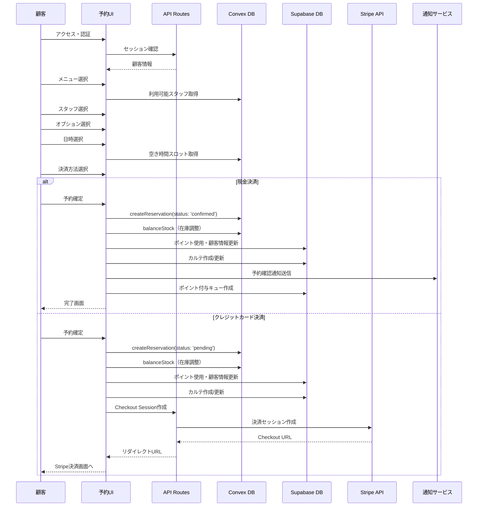
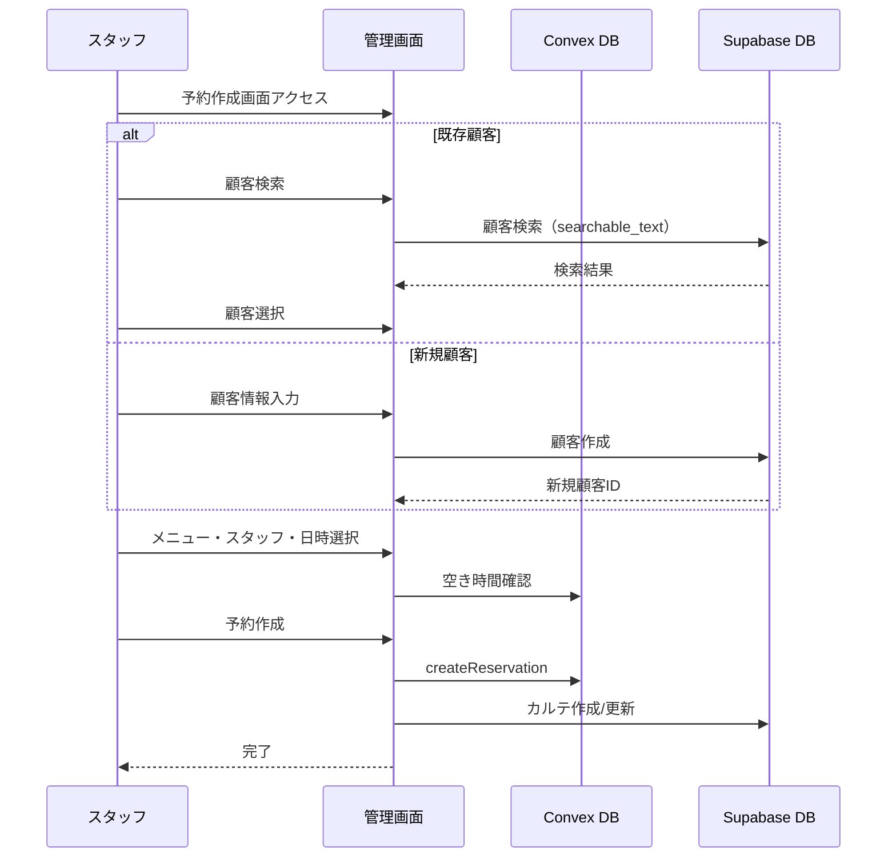

# 予約作成処理実装ガイド

最終更新日: 2025年1月19日

## 1. 概要

このドキュメントは、Bocker（ブッカー）における予約作成機能の包括的な実装ガイドです。予約作成は複数のシステム（Convex、Supabase、Stripe、通知サービス）にまたがる複雑な処理であり、データ整合性を保ちながら確実に実行する必要があります。

### 1.1 予約作成の2つのエントリーポイント

1. **顧客向け予約ページ** (`/reservation/[id]/calendar/`)
   - LINE/メール認証済み顧客が利用
   - ステップバイステップのウィザード形式
   - 決済方法選択（現金/クレジットカード/両方対応）

2. **管理画面予約作成** (`/dashboard/reservation/add/`)
   - スタッフが顧客の代わりに予約作成
   - 既存顧客検索または新規顧客作成
   - 現金決済のみ対応

### 1.2 予約作成時の影響範囲

```
予約作成
├── Convex（リアルタイムDB）
│   ├── reservation: 予約本体の作成
│   ├── reservation_detail: 予約詳細の作成
│   └── option: 在庫数の減算
├── Supabase（履歴DB）
│   ├── customer: 顧客情報更新（最終予約日、予約回数）
│   ├── customer_points: ポイント使用（即時減算）
│   ├── point_transaction: ポイント使用履歴
│   ├── point_task_queue: ポイント付与予約（30日後）
│   ├── carte: カルテ作成/LTV更新
│   └── carte_detail: 施術詳細記録
├── Stripe（クレジットカード決済時）
│   └── Checkout Session作成
└── 通知
    ├── メール送信（予約確認）
    └── LINE送信（予約確認）
```

## 2. データベース設計と操作

### 2.1 Convexテーブル構造

#### reservation（予約本体）
```typescript
{
  _id: Id<"reservation">,
  tenant_id: Id<"tenant">,
  org_id: Id<"organization">,
  customer_id: string, // Supabase customer.uid
  staff_id: Id<"staff">,
  customer_name: string,
  staff_name: string,
  status: "pending" | "confirmed" | "completed" | "cancelled" | "refunded",
  payment_status: "pending" | "paid" | "failed" | "cancelled",
  stripe_checkout_session_id?: string,
  date: string, // "YYYY-MM-DD"
  start_time_unix: number,
  end_time_unix: number,
  _creationTime: number,
  updated_at: number,
  is_archive: boolean
}
```

#### reservation_detail（予約詳細）
```typescript
{
  _id: Id<"reservation_detail">,
  tenant_id: Id<"tenant">,
  org_id: Id<"organization">,
  reservation_id: Id<"reservation">,
  coupon_id?: Id<"coupon">,
  total_price: number,
  payment_method: "cash" | "credit_card" | "all",
  menus: Array<{
    id: Id<"menu">,
    name: string,
    price: number,
    quantity: number
  }>,
  options: Array<{
    id: Id<"option">,
    name: string,
    price: number,
    quantity: number
  }>,
  extra_charge: number, // スタッフ指名料
  use_points?: number,
  coupon_discount?: number,
  featured_hair_images?: Array<{
    original_url: string,
    thumbnail_url: string
  }>,
  notes?: string,
  _creationTime: number,
  updated_at: number,
  is_archive: boolean
}
```

### 2.2 Supabaseテーブル操作

#### customer関連
```sql
-- 顧客情報更新
UPDATE customer SET
  phone = $1,
  last_reservation_date_unix = $2,
  total_reservation_count = total_reservation_count + 1,
  updated_at = NOW()
WHERE uid = $3;

-- ポイント使用（原子的更新）
CALL update_customer_points_atomic(
  p_customer_uid := $1,
  p_points_delta := -$2  -- 負の値で減算
);
```

#### carte関連
```sql
-- カルテ作成または取得
INSERT INTO carte (tenant_id, org_id, customer_id, ltv_price)
VALUES ($1, $2, $3, 0)
ON CONFLICT (tenant_id, org_id, customer_id) 
DO UPDATE SET updated_at = NOW()
RETURNING *;

-- LTV更新
UPDATE carte SET 
  ltv_price = ltv_price + $1,
  updated_at = NOW()
WHERE id = $2;

-- カルテ詳細作成
INSERT INTO carte_detail (
  tenant_id, org_id, carte_id, reservation_id, staff_id,
  staff_name, service_start_time, menu_details, option_details,
  total_price, customer_requests
) VALUES ($1, $2, $3, $4, $5, $6, $7, $8, $9, $10, $11);
```

## 3. 予約作成フロー詳細

### 3.1 顧客向け予約フロー



### 3.2 管理画面予約フロー



## 4. 重要な処理の実装詳細

### 4.1 ダブルブッキング防止

```typescript
// convex/reservation/mutation.ts
export const create = mutation({
  handler: async (ctx, args) => {
    // 1. 組織全体の同時予約数チェック
    const existingReservations = await ctx.db
      .query("reservation")
      .withIndex("by_org_date_status_archive", q =>
        q.eq("org_id", args.org_id)
         .eq("date", args.date)
         .eq("status", "confirmed")
         .eq("is_archive", false)
      )
      .filter(q => /* 時間帯の重複チェック */)
      .collect();
    
    if (existingReservations.length >= config.available_sheet) {
      throw new Error("予約枠が満員です");
    }
    
    // 2. スタッフの重複予約チェック
    const staffReservations = await ctx.db
      .query("reservation")
      .withIndex("by_staff_date_status_archive", q =>
        q.eq("staff_id", args.staff_id)
         .eq("date", args.date)
         .eq("status", "confirmed")
         .eq("is_archive", false)
      )
      .filter(q => /* 時間帯の重複チェック */)
      .collect();
    
    if (staffReservations.length > 0) {
      throw new Error("選択されたスタッフは既に予約が入っています");
    }
    
    // 3. 予約作成（レースコンディション対策込み）
    const reservation = await ctx.db.insert("reservation", {
      ...args,
      _creationTime: Date.now(),
      updated_at: Date.now(),
    });
    
    return reservation;
  }
});
```

### 4.2 ポイント処理

#### 使用時の即時処理
```typescript
// 顧客向け予約画面
if (usePoints > 0) {
  // Supabaseで原子的にポイント減算
  const { error } = await supabase.rpc('update_customer_points_atomic', {
    p_customer_uid: customerUid,
    p_points_delta: -usePoints
  });
  
  // トランザクション記録
  await pointTransactionRepo.create({
    tenant_id,
    org_id,
    customer_id: customerUid,
    reservation_id: reservationId,
    points: -usePoints,
    transaction_type: 'use',
    transaction_date_unix: Date.now(),
    description: `予約時のポイント使用 (予約ID: ${reservationId})`
  });
}
```

#### 付与予約（30日後）
```typescript
// ポイント付与設定に基づいて計算
const earnPoints = pointConfig.point_type === 'fixed' 
  ? pointConfig.grant_point 
  : Math.floor(totalPrice * pointConfig.grant_point / 100);

// タスクキューに登録
await pointTaskQueueRepo.create({
  tenant_id,
  org_id,
  customer_id: customerUid,
  reservation_id: reservationId,
  points: earnPoints,
  scheduled_for_unix: Date.now() + (30 * 24 * 60 * 60 * 1000), // 30日後
  status: 'pending'
});
```

### 4.3 在庫管理

```typescript
// convex/option/mutation.ts
export const balanceStock = mutation({
  args: {
    option_id: v.id("option"),
    quantity: v.number(), // 負の値で減算、正の値で加算
  },
  handler: async (ctx, args) => {
    const option = await ctx.db.get(args.option_id);
    if (!option || option.in_stock === null) {
      throw new Error("在庫管理されていないオプションです");
    }
    
    const newStock = option.in_stock + args.quantity;
    if (newStock < 0) {
      throw new Error("在庫が不足しています");
    }
    
    await ctx.db.patch(args.option_id, {
      in_stock: newStock,
      updated_at: Date.now(),
    });
  }
});
```

### 4.4 決済処理

#### Stripe Checkout Session作成
```typescript
// app/api/stripe/checkout/route.ts
const session = await stripe.checkout.sessions.create({
  payment_method_types: ['card'],
  line_items: [
    {
      price_data: {
        currency: 'jpy',
        product_data: {
          name: `${orgName} - 予約`,
          description: menus.map(m => m.name).join(', '),
        },
        unit_amount: totalPrice,
      },
      quantity: 1,
    },
  ],
  mode: 'payment',
  success_url: `${process.env.NEXT_PUBLIC_APP_URL}/reservation/${orgId}/calendar/complete`,
  cancel_url: `${process.env.NEXT_PUBLIC_APP_URL}/reservation/${orgId}/calendar`,
  metadata: {
    reservation_id: reservationId,
    customer_id: customerId,
    tenant_id: tenantId,
    org_id: orgId,
  },
  payment_intent_data: {
    application_fee_amount: Math.floor(totalPrice * 0.1), // 10%手数料
    transfer_data: {
      destination: stripeAccountId, // サロンのStripe Connect ID
    },
  },
});
```

### 4.5 通知送信

#### LINE通知
```typescript
// services/line/message_template/reservation_flex.ts
export const reservationFlexMessageTemplate = (data: ReservationData) => ({
  type: 'flex',
  altText: '予約確認',
  contents: {
    type: 'bubble',
    body: {
      type: 'box',
      layout: 'vertical',
      contents: [
        {
          type: 'text',
          text: '予約確認',
          weight: 'bold',
          size: 'xl',
        },
        // 予約詳細...
        {
          type: 'button',
          action: {
            type: 'uri',
            label: '予約詳細を見る',
            uri: `${process.env.NEXT_PUBLIC_APP_URL}/customer/${orgId}/${customerId}/reservation/${reservationId}`
          }
        }
      ]
    }
  }
});
```

## 5. エラーハンドリング

### 5.1 エラーパターンと対処

| エラーケース | 原因 | 対処方法 | ロールバック |
|------------|------|---------|------------|
| ダブルブッキング | 同時予約による競合 | エラーメッセージ表示、時間再選択 | 不要 |
| 在庫不足 | オプション在庫切れ | エラー表示、オプション再選択 | 不要 |
| ポイント不足 | 残高不足 | エラー表示、ポイント使用量調整 | 不要 |
| 決済失敗 | Stripeエラー | エラー表示、決済方法変更 | 予約削除 |
| 通知送信失敗 | API エラー | ログ記録のみ（予約は成功） | 不要 |
| カルテ作成失敗 | DBエラー | ログ記録のみ（予約は成功） | 不要 |

### 5.2 トランザクション管理

```typescript
// 部分的失敗を許容する設計
try {
  // 1. 必須処理（失敗時は全体をキャンセル）
  const reservationId = await createReservation();
  await adjustOptionStock();
  await useCustomerPoints();
  
  // 2. 準必須処理（失敗してもログを残して続行）
  try {
    await updateCustomerInfo();
    await createCarte();
  } catch (error) {
    console.error('Non-critical error:', error);
    // エラーログを記録するが処理は続行
  }
  
  // 3. 非同期処理（失敗しても影響なし）
  sendNotification().catch(console.error);
  
} catch (criticalError) {
  // 必須処理の失敗時はロールバック
  await rollbackReservation();
  throw criticalError;
}
```

## 6. パフォーマンス最適化

### 6.1 データ取得の最適化

```typescript
// 統合データ取得（1回のクエリで必要な全データを取得）
export const getReservationFormData = query({
  handler: async (ctx, args) => {
    const [config, menus, options, staff, weekSchedules] = await Promise.all([
      getReservationConfig(ctx, args),
      getAvailableMenus(ctx, args),
      getAvailableOptions(ctx, args),
      getAvailableStaff(ctx, args),
      getWeekSchedules(ctx, args),
    ]);
    
    return { config, menus, options, staff, weekSchedules };
  }
});
```

### 6.2 並列処理

```typescript
// 独立した処理は並列実行
const [
  customerResult,
  carteResult,
  notificationResult
] = await Promise.allSettled([
  updateCustomerInfo(),
  createCarteRecord(),
  sendNotifications()
]);
```

### 6.3 キャッシュ活用

```typescript
// 空き時間スロットのメモ化
const availableSlots = useMemo(() => 
  calculateAvailableSlots(date, staffId, duration),
  [date, staffId, duration]
);
```

## 7. セキュリティ考慮事項

### 7.1 認証・認可

1. **顧客向け**
   - JWTクッキーによるセッション管理
   - 自身の予約のみ作成可能
   - 組織の公開設定に基づくアクセス制御

2. **管理画面**
   - Clerk認証必須
   - 組織内のスタッフのみアクセス可能
   - 権限レベルに応じた機能制限

### 7.2 入力検証

```typescript
// Zodスキーマによる厳密な検証
const reservationSchema = z.object({
  customer_id: z.string().uuid(),
  staff_id: z.string(),
  menus: z.array(menuSchema).min(1),
  start_time_unix: z.number().positive(),
  end_time_unix: z.number().positive(),
  total_price: z.number().nonnegative(),
  payment_method: z.enum(['cash', 'credit_card']),
});
```

### 7.3 データ保護

- 個人情報の最小限の保持
- 決済情報はStripeに委託（PCI DSS準拠）
- 通信はHTTPS必須
- XSS/CSRF対策の実装

## 8. テストシナリオ

### 8.1 正常系テスト

1. **現金決済予約**
   - メニュー・スタッフ・日時選択
   - ポイント使用なし
   - 予約確定 → 通知受信確認

2. **クレジットカード決済予約**
   - 全オプション選択
   - ポイント・クーポン併用
   - Stripe決済完了 → ステータス確認

3. **新規顧客予約（管理画面）**
   - 顧客情報新規作成
   - 予約作成
   - カルテ自動生成確認

### 8.2 異常系テスト

1. **ダブルブッキング**
   - 同時に同じ時間帯を予約
   - 適切なエラーメッセージ確認

2. **在庫切れ**
   - 在庫0のオプション選択
   - エラーハンドリング確認

3. **決済失敗**
   - Stripeテストカードで失敗
   - 予約ステータス確認

## 9. 監視とログ

### 9.1 監視項目

- 予約成功率
- 平均予約完了時間
- エラー発生率（種類別）
- 決済成功率
- API応答時間

### 9.2 ログ設計

```typescript
// 予約作成ログ
{
  event: "reservation_created",
  reservation_id: "xxx",
  customer_id: "xxx",
  payment_method: "cash",
  total_price: 5000,
  processing_time_ms: 1234,
  errors: [],
  timestamp: "2025-01-19T10:00:00Z"
}
```

## 10. 今後の改善提案

### 10.1 機能拡張

1. **リアルタイム在庫表示**
   - WebSocketで在庫変動を即座に反映
   - 選択中のオプションの在庫切れ通知

2. **AIレコメンデーション**
   - 過去の予約履歴から最適なメニュー提案
   - 空き時間の有効活用提案

3. **グループ予約対応**
   - 複数人の同時予約
   - 部屋・設備の管理機能

### 10.2 技術的改善

1. **トランザクション強化**
   - Convex-Supabase間の分散トランザクション
   - Sagaパターンの実装

2. **キューイング最適化**
   - 予約処理のキュー化
   - 負荷分散とスケーラビリティ向上

3. **エラーリカバリー**
   - 自動リトライ機能
   - 部分的成功の補償処理

## 11. 実装チェックリスト

### 11.1 必須実装項目

- [x] Convex予約作成mutation
- [x] ダブルブッキング防止ロジック
- [x] 在庫管理システム
- [x] ポイント使用・付与ロジック
- [x] 顧客情報更新
- [x] カルテ作成・更新
- [x] 現金決済フロー
- [x] Stripe決済統合
- [ ] Stripe Webhookハンドラー（checkout.session.completed）
- [x] メール通知
- [x] LINE通知

### 11.2 管理画面固有

- [x] 顧客検索機能
- [x] 新規顧客作成
- [x] 簡略化された予約フロー
- [x] カルテ自動作成

### 11.3 顧客向けページ固有

- [x] ステップバイステップUI
- [x] リアルタイム空き状況確認
- [x] 決済方法選択
- [x] クーポン・ポイント使用

---

このドキュメントは実装の進行に応じて更新されます。
質問や提案がある場合は、開発チームまでご連絡ください。
## 7. 決済失敗対策の実装（2025年1月更新）

### 7.1 改善された決済フロー

以前の実装では、決済失敗時にポイントが戻らない、在庫が確保されたままになるなどの問題がありました。これらの問題を解決するため、以下の改善を実装しました。

#### 1. ポイント使用タイミングの変更
```typescript
// 予約作成時
const reservationData = {
  use_points: 0, // 即座には使用しない
  intended_point_use: usePoints, // 使用予定を記録
  pending_duration_minutes: 30, // 有効期限設定
};

// Stripe Webhook（決済成功時）
if (reservation.intended_point_use > 0) {
  // 実際にポイントを使用
  await pointTransactionRepo.create({
    points: -reservation.intended_point_use,
    transaction_type: 'used',
  });
}
```

#### 2. 在庫の仮押さえシステム
```typescript
// 新しいテーブル: option_stock_hold
{
  option_id: Id<"option">,
  reservation_id: Id<"reservation">,
  quantity: number,
  expires_at: number,
  status: "held" | "confirmed" | "released"
}

// 在庫仮押さえ
await holdStockMutation({
  option_id,
  reservation_id,
  quantity,
  hold_duration_minutes: 30,
});

// 決済成功時に確定
await confirmStockHold({ reservation_id });

// キャンセル時に解放
await releaseStockHold({ reservation_id });
```

#### 3. 自動クリーンアップ
```typescript
// Convex cronジョブ設定
crons.interval(
  'cleanup expired pending reservations',
  { minutes: 60 },
  internal.reservation.payment.cleanupExpiredPendingReservations
)

// 期限切れpending予約を自動キャンセル
- status を 'cancelled' に更新
- cancelled_by を 'system' に設定
- 仮押さえ在庫を解放
```

### 7.2 管理画面でのpending予約管理

```typescript
// pending予約一覧の取得
const pendingReservations = await convexQuery(
  api.reservation.query.getPendingReservations,
  {
    tenant_id,
    org_id,
    includeExpired: true, // 期限切れも含む
  }
);

// 各予約に以下の情報が付加される
{
  ...reservation,
  isExpired: boolean, // 期限切れフラグ
  expiresIn: number | null, // 残り時間（ミリ秒）
  expiresInMinutes: number | null, // 残り時間（分）
}
```

### 7.3 決済再試行機能

```typescript
// 決済再試行（有効期限を延長）
await retryPaymentMutation({
  reservation_id,
});

// フロントエンド実装例
{reservation.status === 'pending' && (
  <Button onClick={() => retryPayment(reservation._id)}>
    決済を再試行する
  </Button>
)}
```

### 7.4 実装チェックリスト

- [x] Convexスキーマに `intended_point_use` と `pending_expiry` フィールドを追加
- [x] `option_stock_hold` テーブルを作成
- [x] 在庫管理を仮押さえ方式に変更
- [x] Stripe Webhook handlerでポイント使用処理を実装
- [x] Cronジョブで自動クリーンアップを設定
- [x] 管理画面用のpending予約クエリを作成
- [x] 決済再試行機能を実装
- [ ] 失敗通知メールテンプレートの作成（オプション）

### 7.5 トラブルシューティング

1. **pending予約が自動キャンセルされない**
   - Convex cronジョブが正常に動作しているか確認
   - `pending_expiry` フィールドが正しく設定されているか確認

2. **在庫数が正しくない**
   - `option_stock_hold` テーブルで仮押さえ状態を確認
   - 期限切れの仮押さえが解放されているか確認

3. **ポイントが二重に使用される**
   - `intended_point_use` と `use_points` の値を確認
   - Webhook処理が重複実行されていないか確認

---

更新者: Claude
更新日: 2025年1月
EOF < /dev/null