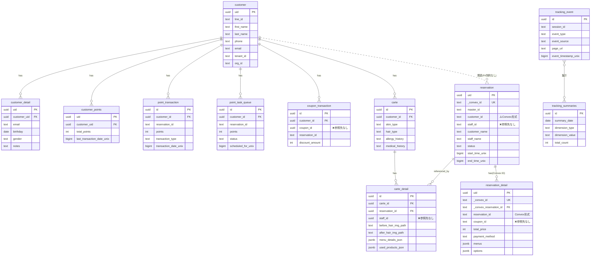

# Supabaseテーブル関係図

## ER図（Entity Relationship Diagram）

## リレーション一覧表

### ✅ 正常に設定されている外部キー制約

| 子テーブル | 子カラム | 親テーブル | 親カラム | 削除時の動作 |
|------------|----------|------------|----------|--------------|
| customer_detail | customer_uid | customer | uid | CASCADE |
| customer_points | customer_uid | customer | uid | CASCADE |
| point_transaction | customer_id | customer | uid | CASCADE |
| point_task_queue | customer_id | customer | uid | CASCADE |
| coupon_transaction | customer_id | customer | uid | CASCADE |
| carte | customer_id | customer | uid | CASCADE |
| carte_detail | carte_id | carte | id | CASCADE |
| carte_detail | reservation_id | reservation | uid | SET NULL |
| reservation_detail | _convex_reservation_id | reservation | _convex_id | CASCADE |

### ⚠️ 外部キー制約が設定できない関係

| テーブル | カラム | 理由 | 対応方法 |
|----------|--------|------|----------|
| reservation | customer_id | text型（Convex ID）とUUID型の不一致 | マッピングテーブルまたはアプリ層で管理 |
| coupon_transaction | coupon_id | couponテーブルが存在しない | Convexで管理 or テーブル追加 |
| carte_detail | staff_id | staffテーブルが存在しない | Convexで管理 or テーブル追加 |
| reservation | staff_id | staffテーブルが存在しない | Convexで管理 or テーブル追加 |
| reservation_detail | coupon_id | couponテーブルが存在しない | Convexで管理 or テーブル追加 |

## データフローの特徴

### 1. **顧客中心の設計**
- `customer`テーブルが中心となり、ほぼ全てのテーブルと関連
- ポイント、クーポン、カルテ、予約が顧客に紐付く

### 2. **Convexとの併用**
- `_convex_id`カラムでConvexのデータと連携
- reservation関連は特にConvex依存が強い

### 3. **独立したトラッキングシステム**
- `tracking_event`と`tracking_summaries`は他のテーブルと独立
- アクセス解析用の別システム

### 4. **セキュリティ上の注意点**
- **全テーブルでRLSが無効** 🚨
- 早急にRLSポリシーの設定が必要

## 推奨事項

1. **短期的対応**
   - RLSポリシーを全テーブルに設定
   - 重要なカラムにインデックスを追加

2. **中期的対応**
   - staffテーブルとcouponテーブルの追加検討
   - またはConvexとの同期ビューを作成

3. **長期的対応**
   - Convex依存を減らし、Supabaseで完結するデータモデルへ移行
   - customer_idの統一（UUID化）