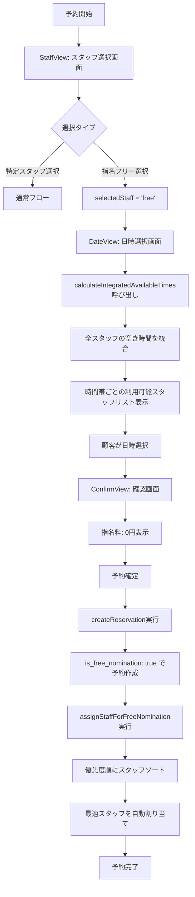
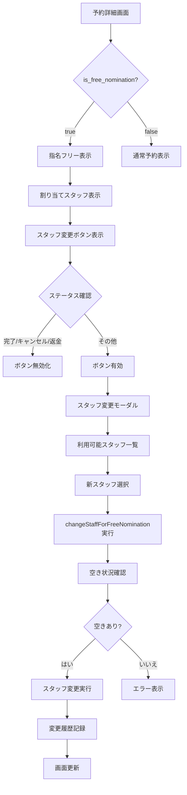
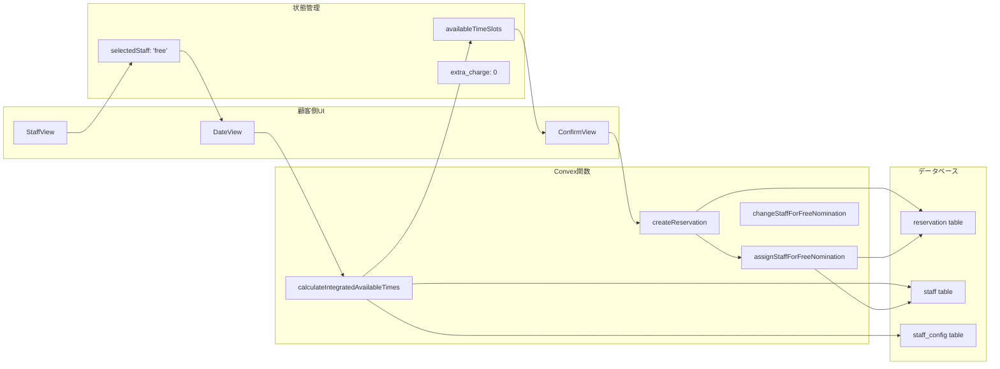
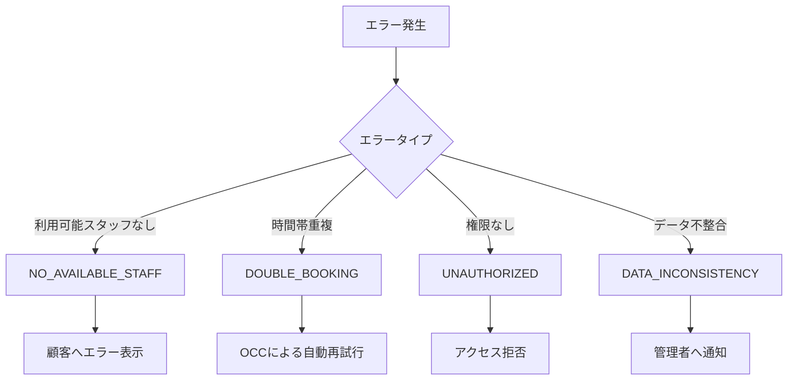

# 指名フリー予約 実装フロー図

## 顧客側予約フロー



## 管理画面フロー



## データフロー



## スタッフ自動割り当てアルゴリズム

```
1. 入力：予約時間帯（start_time, end_time）
2. 処理：
   a. 該当時間帯で利用可能なスタッフを取得
   b. メニュー除外スタッフを除外
   c. 既存予約との重複チェック
   d. 利用可能スタッフを優先度（priority）でソート
   e. 最も優先度の高いスタッフを選択
3. 出力：割り当てスタッフ情報
```

## エラーハンドリング



## パフォーマンス最適化のポイント

1. **並列処理**
   - メニュー・オプション情報の並列取得
   - スタッフ設定の一括取得

2. **キャッシュ活用**
   - スタッフ基本情報のキャッシュ
   - 営業時間設定のキャッシュ

3. **インデックス最適化**
   - by_tenant_org_staff_date_status_archive
   - by_tenant_org_date_status_archive

4. **Map構造の活用**
   - O(n²) → O(n)への計算量削減