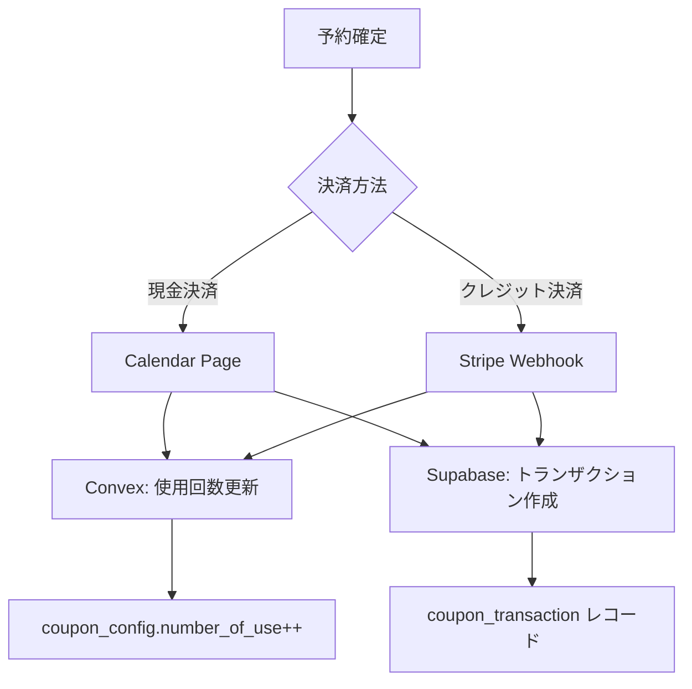

# クーポントランザクショントラッキング実装ドキュメント

最終更新日: 2025年1月

## 概要

このドキュメントは、Bockerシステムにおけるクーポン使用履歴（トランザクション）の追跡機能の実装について説明します。この機能により、クーポンの使用状況を正確に記録し、分析可能なデータとして保存します。

## アーキテクチャ

### データベース設計

クーポントランザクションの追跡は、Bockerのハイブリッドデータベース設計に従います：

- **Convex**: クーポンマスターデータと使用回数のリアルタイム管理
- **Supabase**: クーポン使用履歴の永続的な保存と分析



## 実装時の注意事項

### 重要なバグ修正（2025年1月）

実装中に発見された致命的なバグと修正内容：

1. **CouponTransactionRepositoryの無限再帰バグ**
   ```typescript
   // ❌ 間違った実装（無限再帰）
   async create(data: CouponTransactionData): Promise<RowType<'coupon_transaction'>> {
     // ...
     return await this.create(insertData); // 自分自身を呼び出している！
   }
   
   // ✅ 正しい実装
   async create(data: CouponTransactionData): Promise<RowType<'coupon_transaction'>> {
     // ...
     return await super.create(insertData); // 親クラスのメソッドを呼び出す
   }
   ```

2. **型定義の不整合**
   - BaseRepositoryのコンストラクタが期待する型と実際に渡される型が不一致
   - SupabaseServiceのインスタンスを正しく受け取るよう修正

## 実装詳細

### 1. データモデル

#### Supabase: coupon_transaction テーブル

```sql
CREATE TABLE coupon_transaction (
    id UUID PRIMARY KEY DEFAULT gen_random_uuid(),
    tenant_id TEXT NOT NULL,
    org_id TEXT NOT NULL,
    coupon_id TEXT NOT NULL,  -- Convex ID (TEXT型)
    customer_id UUID NOT NULL REFERENCES customer(uid),
    reservation_id TEXT NOT NULL,  -- Convex ID
    transaction_date_unix BIGINT NOT NULL,
    discount_amount INTEGER,
    created_at TIMESTAMPTZ NOT NULL DEFAULT now(),
    updated_at TIMESTAMPTZ NOT NULL DEFAULT now(),
    is_archive BOOLEAN NOT NULL DEFAULT false,
    deleted_at TIMESTAMPTZ DEFAULT NOW() + INTERVAL '2 years'
);
```

### 2. リポジトリ実装

#### CouponTransactionRepository

```typescript
// services/supabase/repositories/coupon/CouponTransactionRepository.ts
export class CouponTransactionRepository extends BaseRepository<'coupon_transaction'> {
  constructor(supabaseService: SupabaseService) {
    super(supabaseService, 'coupon_transaction')
  }

  async create(data: CouponTransactionInput): Promise<RowType<'coupon_transaction'>> {
    return this.insert(data)
  }

  async findByReservation(
    tenantId: string,
    orgId: string,
    reservationId: string
  ): Promise<RowType<'coupon_transaction'> | null> {
    return this.findOne({
      tenant_id: tenantId,
      org_id: orgId,
      reservation_id: reservationId,
    })
  }

  async findByCustomer(
    tenantId: string,
    orgId: string,
    customerId: string
  ): Promise<RowType<'coupon_transaction'>[]> {
    return this.findMany({
      tenant_id: tenantId,
      org_id: orgId,
      customer_id: customerId,
    })
  }
}
```

### 3. 現金決済フロー

現金決済時のクーポントランザクション作成は、予約カレンダーページで実装されています。

```typescript
// app/[locale]/(reservation)/reservation/[id]/calendar/page.tsx

// 決済確定処理内
if (appliedDiscount.couponId && appliedDiscount.discount > 0 && customerData?.customer?.uid) {
  try {
    const supabase = createClient(
      getEnv('NEXT_PUBLIC_SUPABASE_URL'),
      getEnv('SUPABASE_SERVICE_ROLE_KEY')
    )
    const supabaseService = new SupabaseService(supabase)
    const couponTransactionRepo = new CouponTransactionRepository(supabaseService)
    
    await couponTransactionRepo.create({
      tenant_id: sessionCustomer.tenantId,
      org_id: organizationComplete.organization._id as Id<'organization'>,
      coupon_id: appliedDiscount.couponId,
      customer_id: customerData.customer.uid,
      reservation_id: reservationId!,
      transaction_date_unix: Date.now(),
      discount_amount: appliedDiscount.discount,
    })
    console.log('クーポン利用履歴を作成しました')
  } catch (error) {
    console.error('クーポン利用履歴の作成でエラーが発生しました:', error)
    // クーポン履歴のエラーは予約を妨げないようにする
  }
}
```

### 4. クレジットカード決済フロー

Stripe Webhookハンドラーでクーポントランザクションを作成します。

```typescript
// services/webhook/stripe/handlers.checkout.ts

export async function handleCheckoutSessionCompleted(
  evt: Stripe.CheckoutSessionCompletedEvent,
  eventId: string,
  deps: WebhookDependencies,
  metrics: WebhookMetricsCollector
): Promise<EventProcessingResult> {
  // ... 既存の処理

  // 5. クーポン使用履歴を作成
  if (reservationDetail.coupon_id && reservationDetail.coupon_discount && reservationDetail.coupon_discount > 0) {
    const couponTransactionRepo = new CouponTransactionRepository(supabaseService);
    
    try {
      await couponTransactionRepo.create({
        tenant_id: tenantId,
        org_id: orgId,
        coupon_id: reservationDetail.coupon_id,
        customer_id: customerUid,
        reservation_id: reservationId,
        transaction_date_unix: Date.now(),
        discount_amount: reservationDetail.coupon_discount,
      });
      
      console.log(`🎟️ [${eventId}] クーポン使用履歴作成完了: couponId=${reservationDetail.coupon_id}, discount=${reservationDetail.coupon_discount}`, context);
    } catch (error) {
      console.error(`⚠️ [${eventId}] クーポン使用履歴作成失敗:`, error);
      // クーポン履歴の作成失敗は処理を継続
    }
  }

  // ... 後続の処理
}
```

## エラーハンドリング

### 非クリティカルエラーの原則

クーポントランザクションの作成は、予約処理の補助的な機能として位置づけられています。そのため：

1. **予約処理を妨げない**: トランザクション作成の失敗は予約をブロックしない
2. **ログ記録**: エラーは必ずログに記録し、後から調査可能にする
3. **継続処理**: エラー発生後も後続の処理（通知送信等）は継続する

```typescript
try {
  // クーポントランザクション作成
} catch (error) {
  console.error('クーポン利用履歴の作成でエラーが発生しました:', error)
  // エラーをログに記録するが、処理は継続
}
```

## Convexとの連携

### 使用回数の管理

クーポンの使用回数（`number_of_use`）はConvexで管理されます：

1. **予約作成時**: `incrementCouponUsage` ミューテーションで使用回数を増加
2. **予約キャンセル時**: `decrementCouponUsage` ミューテーションで使用回数を減少

```typescript
// convex/coupon/config/mutation.ts
export const incrementCouponUsage = internalMutation({
  args: { 
    couponId: v.id("coupon_config"),
    tenantId: v.id("tenant"),
    orgId: v.id("organization")
  },
  handler: async (ctx, args) => {
    const coupon = await ctx.db.get(args.couponId);
    if (!coupon) throw new Error("クーポンが見つかりません");
    
    await ctx.db.patch(args.couponId, {
      number_of_use: (coupon.number_of_use || 0) + 1
    });
  }
});
```

## データ分析の活用

Supabaseに保存されたクーポントランザクションデータは以下の分析に活用できます：

### 1. クーポン使用統計

```sql
-- クーポン別の使用回数と総割引額
SELECT 
    coupon_id,
    COUNT(*) as usage_count,
    SUM(discount_amount) as total_discount
FROM coupon_transaction
WHERE tenant_id = ? AND org_id = ?
    AND is_archive = false
GROUP BY coupon_id;
```

### 2. 顧客別クーポン利用履歴

```sql
-- 特定顧客のクーポン利用履歴
SELECT 
    ct.*,
    c.first_name || ' ' || c.last_name as customer_name
FROM coupon_transaction ct
JOIN customer c ON ct.customer_id = c.uid
WHERE ct.customer_id = ?
    AND ct.is_archive = false
ORDER BY ct.transaction_date_unix DESC;
```

### 3. 期間別クーポン利用状況

```sql
-- 月別クーポン利用状況
SELECT 
    DATE_TRUNC('month', TO_TIMESTAMP(transaction_date_unix / 1000)) as month,
    COUNT(*) as usage_count,
    SUM(discount_amount) as total_discount
FROM coupon_transaction
WHERE tenant_id = ? AND org_id = ?
    AND transaction_date_unix >= ?
    AND transaction_date_unix <= ?
    AND is_archive = false
GROUP BY month
ORDER BY month;
```

## 今後の拡張可能性

### 1. クーポン効果測定

- ROI分析（クーポン割引額 vs 売上増加）
- リピート率への影響分析
- 顧客セグメント別の効果測定

### 2. 不正利用検知

- 異常な利用パターンの検出
- 同一顧客による過度な利用の監視
- IPアドレスやデバイス情報との紐付け

### 3. レポーティング機能

- 定期的なクーポン利用レポートの自動生成
- ダッシュボードでのリアルタイム表示
- CSVエクスポート機能

## 注意事項

1. **データ整合性**: Convexの使用回数とSupabaseのトランザクション数は必ずしも一致しない可能性がある（エラー時など）
2. **パフォーマンス**: 大量のトランザクションが発生する場合は、インデックスの追加を検討
3. **データ保持期間**: `deleted_at`により2年後に自動削除されるため、長期分析が必要な場合は別途アーカイブが必要

## 関連ドキュメント

- [予約・決済フロー](./reservation-and-payment.md)
- [在庫管理システム](./inventory-management.md)
- [ポイントシステム](./point-system.md)