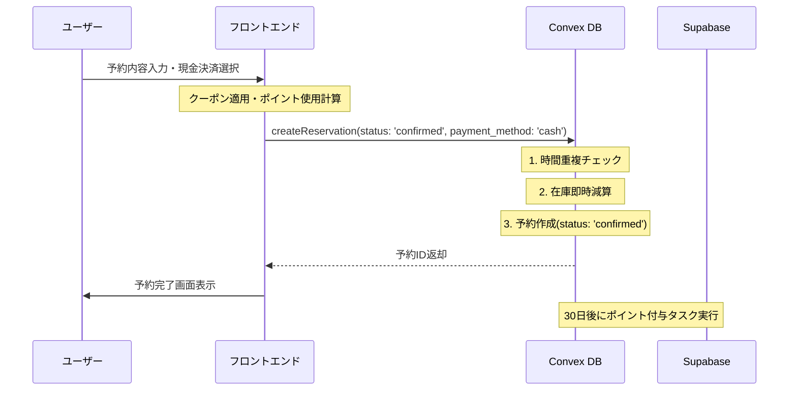
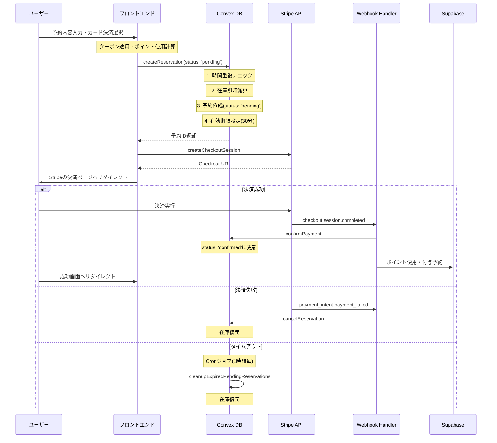
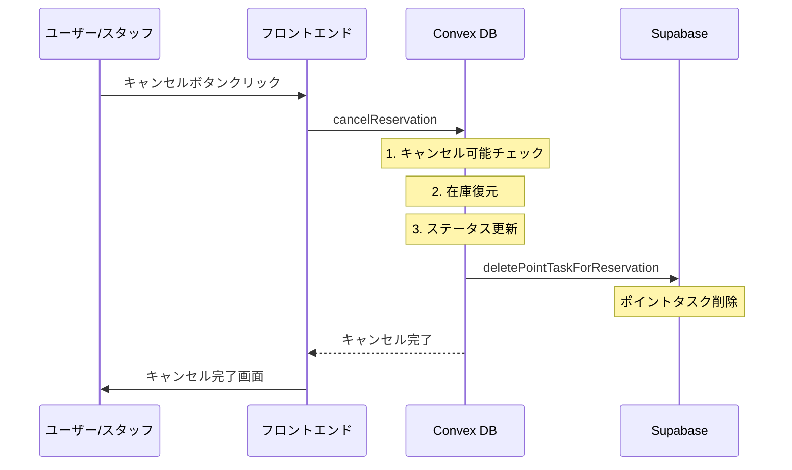

# 予約フロー詳細ドキュメント

**最終更新**: 2025年6月23日  
**ドキュメントバージョン**: 2.0

## 概要

このドキュメントでは、Bockerの予約システムにおける予約作成・決済・キャンセルの詳細なフローを説明します。楽観的在庫管理アプローチを採用し、高いユーザビリティと在庫整合性を両立しています。

### 主な機能
- **現金決済・クレジットカード決済**の両方に対応
- **クーポン割引**による柔軟な価格設定
- **ポイントシステム**による顧客ロイヤリティ向上
- **在庫管理**による適切なオプション数量管理
- **自動キャンセル**による在庫の効率的な運用

## アーキテクチャ概要

### データベース設計
- **Convex**: リアルタイムデータ（アクティブな予約、在庫管理）
- **Supabase**: 履歴データ（完了済み予約、ポイント取引、顧客マスター）

### 在庫管理方式
- **楽観的アプローチ**: 予約作成時に即座に在庫を減算
- **リアルタイム反映**: 他のユーザーにも即座に在庫状況が反映
- **自動復元**: キャンセル・失敗時に在庫を自動復元

## 1. 予約作成フロー

### 1.1 現金決済の場合



#### 処理詳細

1. **予約作成** (`convex/reservation/mutation.ts - create`)
   ```typescript
   // 在庫の楽観的減算
   if (args.options && args.options.length > 0) {
     const stockResult = await ctx.runMutation(
       internal.option.stock.decrementStockForReservation,
       { options: args.options }
     );
   }
   
   // 予約作成
   const { reservationId } = await createReservationWithDetails(ctx, {
     ...args,
     status: 'confirmed',
     payment_status: 'paid',
     payment_method: 'cash'
   });
   ```

2. **ポイント付与予約** 
   - 現金決済の場合は予約作成時点でポイントタスクをSupabaseに登録
   - 30日後に自動実行される

### 1.2 クレジットカード決済の場合



#### 処理詳細

1. **予約作成** (`convex/reservation/mutation.ts - create`)
   ```typescript
   // pending状態の有効期限を設定（デフォルト30分）
   const pending_expiry = args.pending_duration_minutes 
     ? Date.now() + args.pending_duration_minutes * 60 * 1000
     : Date.now() + 30 * 60 * 1000;
   
   // 楽観的在庫管理: 予約作成時に即座に在庫を減算
   if (args.options && args.options.length > 0) {
     const stockResult = await ctx.runMutation(
       internal.option.stock.decrementStockForReservation,
       { options: args.options }
     );
   }
   ```

2. **Checkout Session作成** (`services/stripe/repositories/StripeConnectRepository.ts`)
   ```typescript
   // Stripe Checkout Sessionの作成
   const session = await stripe.checkout.sessions.create({
     payment_method_types: ['card'],
     line_items: [{
       price_data: {
         currency: 'jpy',
         product_data: {
           name: '予約サービス',
         },
         unit_amount: totalPrice,  // クーポン・ポイント適用後の金額
       },
       quantity: 1,
     }],
     metadata: {
       reservation_id: reservation_id,
       stripe_account_id: stripe_account_id,
       tenant_id: tenant_id,
       org_id: org_id,
     }
   });
   ```
   
   **重要**: 
   - `unit_amount`はクーポンとポイント適用後の最終支払額
   - クーポン情報は`reservation_detail`に保存済み
   - ポイントは`use_points`として保存

3. **決済成功時の処理** (`services/webhook/stripe/handlers.checkout.ts - handleCheckoutSessionCompleted`)
   - 予約ステータスを`confirmed`に更新
   - 支払いステータスを`paid`に更新
   - ポイント使用処理（あれば）
   - 通知送信（メール・LINE）
   - ポイント付与タスク登録（30日後）

4. **決済失敗・タイムアウト時の処理**
   - 自動的に`cancelReservation`を呼び出し
   - 在庫を復元
   - ポイントタスクを削除

## 2. キャンセルフロー

### 2.1 キャンセル処理の流れ



### 2.2 キャンセル処理詳細

```typescript
// convex/reservation/mutation.ts - cancelReservation
export const cancelReservation = mutation({
  handler: async (ctx, args) => {
    // 1. キャンセル期限チェック（顧客の場合のみ）
    if (args.cancelledBy === 'customer' && !args.skipValidation) {
      const cancelDeadline = reservation.start_time_unix - 
        (orgConfig?.available_cancel_days || 1) * 24 * 60 * 60 * 1000;
      
      if (Date.now() > cancelDeadline) {
        throw new ConvexError({ message: 'Cancellation deadline has passed' });
      }
    }
    
    // 2. 楽観的在庫管理: キャンセル時に在庫を復元
    if (details?.options && details.options.length > 0) {
      await ctx.runMutation(internal.option.stock.restoreStockForCancellation, {
        options: details.options
      });
    }
    
    // 3. ポイントタスク削除
    await ctx.scheduler.runAfter(0, internal.reservation.action.deletePointTaskForReservation, {
      tenant_id: reservation.tenant_id,
      org_id: reservation.org_id,
      reservation_id: args.reservationId,
    });
    
    // 4. ステータス更新（キャンセル情報はreservation_detailのみに保存）
    await ctx.db.patch(args.reservationId, {
      status: 'cancelled',
      updated_at: Date.now(),
    });
    
    // 5. 予約詳細も更新
    await ctx.db.patch(details._id, {
      cancellation_info: {
        cancelled_at: Date.now(),
        cancelled_by: args.cancelledBy,
        reason: args.cancelReason,
      }
    });
  }
});
```

## 3. 料金計算フロー

### 3.1 計算順序

料金計算は以下の順序で行われます：

```
1. 基本料金 = メニュー料金合計 + オプション料金合計 + 追加料金
2. クーポン適用後料金 = 基本料金 - クーポン割引額
3. 最終支払額 = クーポン適用後料金 - ポイント使用額
```

### 3.2 実装例

```typescript
// フロントエンドでの計算例
const calculateTotalPrice = () => {
  // 1. 基本料金計算
  const menuTotal = menus.reduce((sum, menu) => sum + (menu.price * menu.quantity), 0);
  const optionTotal = options.reduce((sum, option) => sum + (option.price * option.quantity), 0);
  const basePrice = menuTotal + optionTotal + (extraCharge || 0);
  
  // 2. クーポン適用
  let discountAmount = 0;
  if (selectedCoupon) {
    if (selectedCoupon.discount_type === 'percentage') {
      discountAmount = Math.floor(basePrice * selectedCoupon.discount_value / 100);
    } else {
      discountAmount = selectedCoupon.discount_value;
    }
    // 最大割引額のチェック
    if (selectedCoupon.max_discount_amount) {
      discountAmount = Math.min(discountAmount, selectedCoupon.max_discount_amount);
    }
  }
  const priceAfterCoupon = basePrice - discountAmount;
  
  // 3. ポイント使用
  const pointsToUse = Math.min(usePoints || 0, customerPoints, priceAfterCoupon);
  const finalPrice = priceAfterCoupon - pointsToUse;
  
  return {
    basePrice,
    couponDiscount: discountAmount,
    pointsUsed: pointsToUse,
    totalPrice: finalPrice
  };
};
```

### 3.3 予約作成時のパラメータ

```typescript
// 予約作成APIに渡すパラメータ
{
  // メニュー・オプション
  menus: [...],
  options: [...],
  extra_charge: 1000,
  
  // クーポン関連
  coupon_id: "coupon_xxx",
  coupon_discount: 500,  // 計算済みの割引額
  
  // ポイント関連（クレジットカード決済の場合）
  use_points: 300,  
  
  // 最終金額
  total_price: 4200,  // クーポン・ポイント適用後の金額
}
```

## 4. 在庫管理の詳細

### 4.1 在庫減算（楽観的アプローチ）

```typescript
// convex/option/stock.ts - decrementStockForReservation
export const decrementStockForReservation = internalMutation({
  handler: async (ctx, args) => {
    const errors = [];
    
    for (const optionRequest of args.options) {
      const option = await ctx.db.get(optionRequest.id);
      
      if (option.stock !== null) {
        const newStock = option.stock - optionRequest.quantity;
        
        if (newStock < 0) {
          errors.push({
            optionId: optionRequest.id,
            optionName: option.name,
            requested: optionRequest.quantity,
            available: option.stock,
            error: `在庫が不足しています: ${option.name}`
          });
          continue;
        }
        
        // 在庫を更新
        await ctx.db.patch(optionRequest.id, { 
          stock: newStock,
          updated_at: Date.now()
        });
      }
    }
    
    return { success: errors.length === 0, errors };
  }
});
```

### 4.2 在庫復元

```typescript
// convex/option/stock.ts - restoreStockForCancellation  
export const restoreStockForCancellation = internalMutation({
  handler: async (ctx, args) => {
    for (const optionToRestore of args.options) {
      const option = await ctx.db.get(optionToRestore.id);
      
      if (option.stock !== null) {
        await ctx.db.patch(optionToRestore.id, {
          stock: option.stock + optionToRestore.quantity,
          updated_at: Date.now()
        });
      }
    }
    
    return { success: true };
  }
});
```

## 5. ポイント・クーポン処理

### 5.1 クーポン適用（予約作成時）

予約作成時にクーポンが適用される場合の処理：

```typescript
// convex/reservation/mutation.ts - create
args: {
  coupon_id: v.optional(v.id('coupon')),      // 使用するクーポンID
  coupon_discount: v.optional(v.number()),     // クーポン割引額
  total_price: v.number(),                     // 割引後の合計金額
}
```

#### クーポン適用フロー
1. **フロントエンドでの計算**
   - クーポンコードを入力
   - クーポンの有効性を確認（有効期限、使用回数制限など）
   - 割引額を計算して表示
   - `total_price`は割引後の金額を設定

2. **予約作成時の保存**
   ```typescript
   // createReservationWithDetails内で自動的に保存
   reservation_detail: {
     coupon_id: args.coupon_id,
     coupon_discount: args.coupon_discount,
     total_price: args.total_price,  // 割引適用後の金額
   }
   ```

3. **クーポン使用回数の更新**
   - 予約受付時にクーポンの使用回数を増加
   - キャンセル時は使用回数を減少（実装による）

### 5.2 ポイント使用（決済成功時）

```typescript
// services/webhook/stripe/handlers.checkout.ts
if (reservation.use_points && reservation.use_points > 0) {
  const pointTransactionRepo = new PointTransactionRepository(supabaseService);
  
  // ポイント使用履歴を作成
  await pointTransactionRepo.create({
    tenant_id: tenantId,
    org_id: orgId,
    reservation_id: reservationId,
    customer_id: customerUid,
    points: -reservation.use_points,
    transaction_type: 'used',
    transaction_date_unix: Date.now(),
    description: `予約での使用 (予約ID: ${reservationId})`,
  });
  
  // 顧客のポイント残高を更新
  await customerRepo.updateCustomerPoints(
    tenantId,
    orgId,
    customerUid,
    -reservation.use_points,
    new Date().getTime() * 1000
  );
}
```

### 5.3 ポイント付与予約（30日後）

```typescript
// ポイント付与タスクの登録
await pointTaskQueueRepo.create({
  tenant_id: tenantId,
  org_id: orgId,
  customer_id: customerUid,
  reservation_id: reservationId,
  points: earnPoints,
  scheduled_for_unix: Date.now() + (30 * 24 * 60 * 60 * 1000), // 30日後
  status: 'pending'
});
```

### 5.4 キャンセル時のポイントタスク削除

```typescript
// convex/reservation/action.ts - deletePointTaskForReservation
export const deletePointTaskForReservation = internalAction({
  handler: async (ctx, args) => {
    const pointTask = await pointTaskQueueRepo.findByReservation(
      args.tenant_id,
      args.org_id,
      args.reservation_id
    );
    
    if (pointTask && pointTask.status === 'pending') {
      await pointTaskQueueRepo.delete('id', pointTask.id);
    }
  }
});
```

## 6. 自動クリーンアップ処理

### 6.1 期限切れpending予約のクリーンアップ

```typescript
// convex/crons.ts - 1時間ごとに実行
crons.interval(
  'cleanup expired pending reservations',
  { minutes: 60 },
  internal.reservation.payment.cleanupExpiredPendingReservations
)

// convex/reservation/payment.ts
export const cleanupExpiredPendingReservations = internalMutation({
  handler: async (ctx) => {
    const expiredReservations = await ctx.db
      .query('reservation')
      .withIndex('status_start_time_archive', q => q.eq('status', 'pending'))
      .filter(q => q.and(
        q.eq(q.field('is_archive'), false),
        q.lte(q.field('pending_expiry'), Date.now())
      ))
      .take(100);
    
    for (const reservation of expiredReservations) {
      await ctx.runMutation(api.reservation.mutation.cancelReservation, {
        reservationId: reservation._id,
        cancelledBy: 'system',
        cancelReason: '決済タイムアウト',
        skipValidation: true,
      });
    }
  }
});
```

## 7. エラーハンドリング

### 7.1 在庫不足エラー
```typescript
if (!stockResult.success && stockResult.errors.length > 0) {
  throw new ConvexError({
    message: stockResult.errors[0].error,
    code: 'INSUFFICIENT_STOCK',
    details: { stockErrors: stockResult.errors }
  });
}
```

### 7.2 重複予約エラー
```typescript
if (isOverlapping) {
  throw new ConvexError({
    message: 'この時間帯の予約はすでにいっぱいです。',
    code: 'CONFLICT',
    status: 409
  });
}
```

### 7.3 Webhook処理のべき等性
- 同じイベントIDで複数回処理されないよう、Stripe Event IDで管理
- 処理済みのイベントはスキップ

## 8. セキュリティ考慮事項

1. **Webhook署名検証**
   - すべてのStripe Webhookは署名検証を実施
   - 不正なリクエストを防止

2. **タイムアウト設定**
   - pending予約は30分で自動キャンセル
   - 在庫の長時間占有を防止

3. **権限チェック**
   - スタッフのみキャンセル期限をスキップ可能
   - 顧客は設定された期限内のみキャンセル可能

## 9. パフォーマンス最適化

1. **並列処理**
   - 通知送信（メール・LINE）は並列実行
   - エラーが発生しても処理は継続

2. **バッチ処理**
   - 期限切れ予約のクリーンアップは100件ずつバッチ処理
   - システム負荷を分散

3. **インデックス活用**
   - `by_status_pending_expiry_archive`インデックスで高速検索
   - 時間重複チェックも専用インデックスを使用